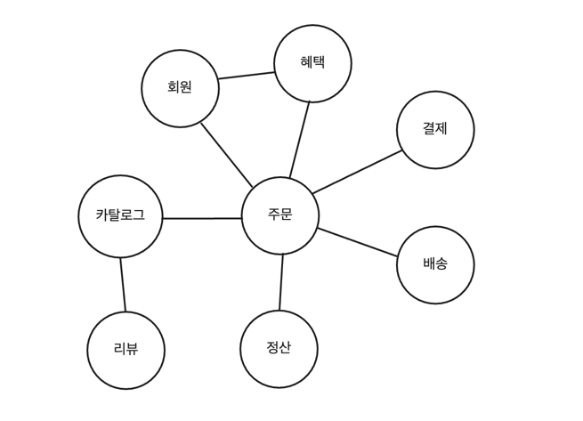
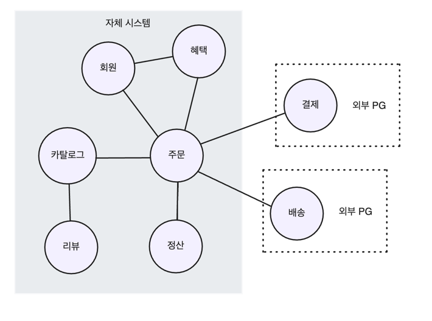

<!-- TOC -->
* [1.1 도메인이란?](#11-도메인이란)
  * [도메인 - 소프트웨어로 해결하고자 하는 문제 영역](#도메인---소프트웨어로-해결하고자-하는-문제-영역-)
  * [한 도메인은 다시 하위 도메인으로 나눌 수 있다](#한-도메인은-다시-하위-도메인으로-나눌-수-있다)
  * [도메인이 제공해야할 모든 기능을 직접 구현하는 것은 아니다](#도메인이-제공해야할-모든-기능을-직접-구현하는-것은-아니다)
* [1.2 도메인 전문가와 개발자 간 지식 공유](#12-도메인-전문가와-개발자-간-지식-공유)
* [1.3 도메인 모델](#13-도메인-모델)
* [1.4 도메인 모델 패턴](#14-도메인-모델-패턴)
* [1.5 도메인 모델 도출](#15-도메인-모델-도출)
* [1.6 엔티티와 밸류](#16-엔티티와-밸류)
  * [1.6.1 엔티티](#161-엔티티)
  * [1.6.2 엔티티의 식별자 생성](#162-엔티티의-식별자-생성)
  * [1.6.3 밸류 타입](#163-밸류-타입)
  * [1.6.4 엔티티 식별자와 밸류 타입 구분](#164-엔티티-식별자와-밸류-타입-구분-)
  * [1.6.5 도메인 모델에 set 메서드 넣지 않기](#165-도메인-모델에-set-메서드-넣지-않기)
* [1.7 도메인 용어와 유비쿼터스 언어](#17-도메인-용어와-유비쿼터스-언어)
<!-- TOC -->

---

- 키워드
  - 도메인
  - 도메인 모델
  - 엔티티와 밸류
  - 도메인 용어

---

# 1.1 도메인이란?

## 도메인 - 소프트웨어로 해결하고자 하는 문제 영역 

- 필자는 책을 사기 위해 온라인 서점을 이용. (장바구니, 결제, 배송 등)
- 개발자 입장에서, 온라인 서점은 구현해야할 소프트웨어의 대상이 됨.
  - 온라인 서점 소프트웨어의 제공 기능
    - 상품 조회
    - 구매 
    - 결제
    - 배송 추적
    - ...
- 이 때 온라인 서점은 ***소프트웨어로 해결하고자 하는 문제 영역***이 된다. 
  - 즉, 여기서는 `온라인 서점`이 `도메인`에 해당한다.

## 한 도메인은 다시 하위 도메인으로 나눌 수 있다

_(도메인은 여러 하위 도메인으로 구성된다.)_

- 하위 도메인 간의 연동
  - 카탈로그 하위 도메인은 고객에게 구매할 수 있는 상품 목록 제공.
  - 주문 하위 도메인은 고객 주문 처리. 혜택 하위 도메인은 쿠폰이나 특별 할인 같은 서비스 제공 
  - ...
- 👉 **_한 하위 도메인은 다른 하위 도메인과 연동하여 완전한 기능 제공_**
  - ex) 고객이 물건을 구매하면 `주문`, `결제`, `배송`, `혜택` **하위 도메인의 기능이 엮이게 된다.** 

## 도메인이 제공해야할 모든 기능을 직접 구현하는 것은 아니다

- 특정 도메인(ex. 온라인 서점)을 위한 소프트웨어라고 해서, 모든 기능을 직접 구현하는 것은 아님.
  - 보통 자체적으로 배송 시스템을 구축하지 않고, 외부 배송 업체 시스템을 사용. 배송 추적 정보를 제공하는 데 **필요한 기능만 일부 연동**
  - 결제 시스템도 직접 구현하기 보다 보통 결제 대행업체를 이용해서 처리.
- ***하위 도메인을 어떻게 구성할지***는 상황에 따라 달라진다.
  - ex) 기업 고객 대상으로 대형 장비를 판매하는 곳
    - 온라인 카탈로그 제공, 주문서 받는 정도만 필요.
    - 온라인 결제, 배송 추적 같은 기능은 불필요.
  - ex) 의류, 액세서리 등 일반 고객 대상으로 할 경우
    - 카탈로그, 리뷰, 주문, 결제, 배송, 회원 기능 등 필요.

 

# 1.2 도메인 전문가와 개발자 간 지식 공유

 

# 1.3 도메인 모델

 

# 1.4 도메인 모델 패턴

 

# 1.5 도메인 모델 도출

 

# 1.6 엔티티와 밸류

## 1.6.1 엔티티

## 1.6.2 엔티티의 식별자 생성

## 1.6.3 밸류 타입

## 1.6.4 엔티티 식별자와 밸류 타입 구분              

## 1.6.5 도메인 모델에 set 메서드 넣지 않기

 

# 1.7 도메인 용어와 유비쿼터스 언어
