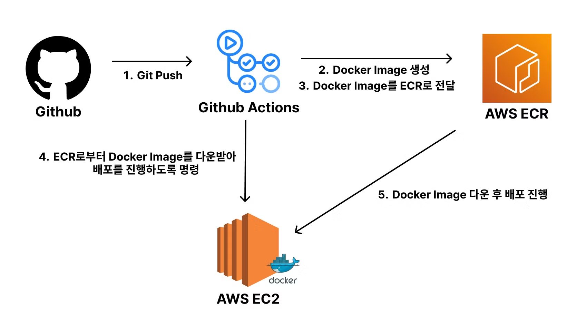

<!-- TOC -->
* [5. EC2 접속](#5-ec2-접속)
  * [인스턴스 요약 정보에 대해](#인스턴스-요약-정보에-대해)
  * [EC2 접속](#ec2-접속-)
    * [브라우저로 접속](#브라우저로-접속)
    * [SSH 접속](#ssh-접속)
* [6. 탄력적 IP 연결하기](#6-탄력적-ip-연결하기)
* [7. Express 서버를 EC2에 배포하기](#7-express-서버를-ec2에-배포하기)
* [7-2. Spring Boot 서버를 EC2에 배포하기](#7-2-spring-boot-서버를-ec2에-배포하기)
* [비용 나가지 않게 EC2 깔끔하게 종료하기](#비용-나가지-않게-ec2-깔끔하게-종료하기)
<!-- TOC -->

# 5. EC2 접속

## 인스턴스 요약 정보에 대해

- 퍼블릭 IPv4 주소
  - 인스턴스의 IP

- 인스턴스 중지: 컴퓨터 종료
- 인스턴스 시작: 컴퓨터 시작
- 인스턴스 종료(Terminate instance): 컴퓨터 '삭제'

## EC2 접속 

### 브라우저로 접속

- 브라우저로 접속 시 위 같은 창이 나타난다.

### SSH 접속

- pem Key가 있는 디렉토리로 이동 후, 명령어 입력 시 터미널에서 접속 가능하다.  
  - `ssh -i "candies-server-key-pair.pem" ubuntu@ec2-43-203-250-59.ap-northeast-2.compute.amazonaws.com`

# 6. 탄력적 IP 연결하기

# 7. Express 서버를 EC2에 배포하기

# 7-2. Spring Boot 서버를 EC2에 배포하기

# 비용 나가지 않게 EC2 깔끔하게 종료하기
