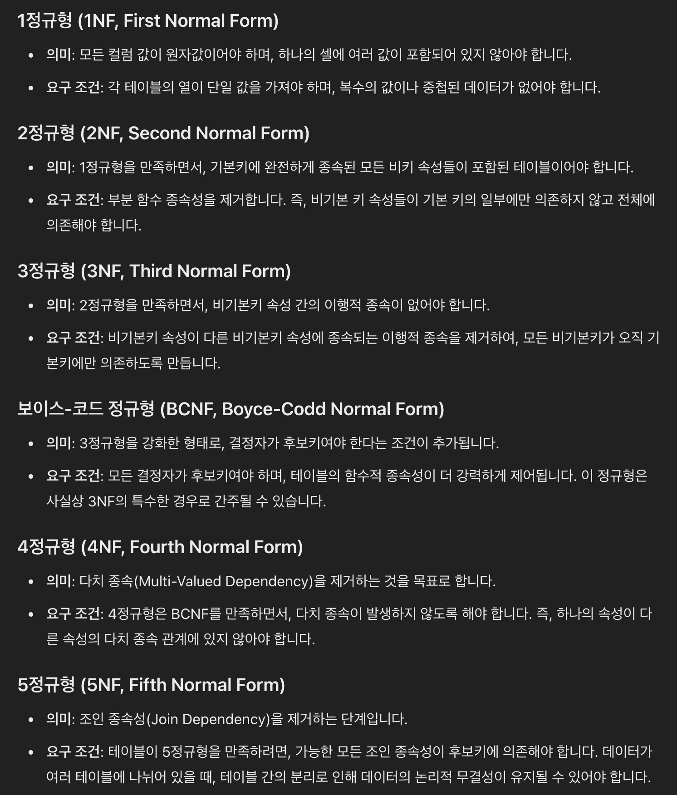

<!-- TOC -->
* [DB 설계할 때 이런 개념들 몰라도 아무 문제 없습니다.](#db-설계할-때-이런-개념들-몰라도-아무-문제-없습니다)
* [DB 설계 시 꼭 기억해야 할 핵심 원칙 1가지](#db-설계-시-꼭-기억해야-할-핵심-원칙-1가지)
  * [DB 설계의 핵심은 중복 없애기](#db-설계의-핵심은-중복-없애기)
  * [정규화](#정규화)
  * [요약](#요약-)
* [DB 설계 전체 과정](#db-설계-전체-과정)
  * [1.](#1-)
  * [2. 그룹핑해서 분류하기](#2-그룹핑해서-분류하기-)
  * [3. 6가지 규칙 적용시키면서 테이블 분리해나가기](#3-6가지-규칙-적용시키면서-테이블-분리해나가기)
* [저장할 데이터 파악하기 / 그룹핑 해서 분류하기 (실습)](#저장할-데이터-파악하기--그룹핑-해서-분류하기-실습)
  * [요구사항](#요구사항)
<!-- TOC -->

# DB 설계할 때 이런 개념들 몰라도 아무 문제 없습니다.

- 기본키, 후보키, 대체키, 슈퍼키
- 개체-관계 모델
- 모델링 과정 (개념적 모델링, 논리적 모델링, 물리적 모델링)
- 이상현상 (삭제 이상, 삽입 이상, 수정이상)

---

- _위 개념들을 다 알아야할까?_ No. 
- 추후 이론 공부를 따로 공부하는 것은 필요하긴 하나, 이걸 현업에서 개발할 때 이 이론들을 다 사용하는 것은 아님.

 

# DB 설계 시 꼭 기억해야 할 핵심 원칙 1가지

## DB 설계의 핵심은 중복 없애기

## 정규화

- 정규형에는 총 6가지 종류의 정규형 존재
- 하지만 실제 현업에서 적용시키는 정규형은 **1정규형, 2정규형, 3정규형**이다. 
  - BCNF, 4정규형, 5정규형을 적용시키면 지나치게 테이블이 분리되어서 관리가 복잡해짐.

- 실제 현업에서는 위의 정규형을 하나하나씩 떠올리면서 설계하지 않는다. 
- 위의 각 정규형 의미를 모르더라도 DB를 설계하는 방법 강의 예정. 
  - 강의처럼 DB 설계를 하고 난 뒤에 결과물을 보면, 1정규형~3정규형을 전부 다 지킨 테이블이 설계가 된다.

## 요약 

- 데이터의 중복이 생기게끔 테이블을 설계하면 데이터끼리 꼬일 수 있음.
- 테이블 설계 시 데이터 중복이 발생하지 않게끔 하는게 중요.

# DB 설계 전체 과정

## 1. 

## 2. 그룹핑해서 분류하기 

- 저장해야하는 데이터를 묶어서 그룹핑할 수 있는 상위 개념 찾기.

## 3. 6가지 규칙 적용시키면서 테이블 분리해나가기

# 저장할 데이터 파악하기 / 그룹핑 해서 분류하기 (실습)

## 요구사항

> 현업에서 아래와 같이 글로만 된 요구 사항만 가지고 DB 설계를 하는 일은 잘 없다. UI(화면) 디자인이 나왔을 때 UI 디자인을 보면서 DB 설계에 들어가는 편이다. 하지만 지금은 연습을 하기 위함이니까 아래 요구사항만 가지고 설계를 해보자. 

- 회원가입 기능
  - 회원가입을 할 때 이메일, 비밀번호, 이름의 정보를 받는다.
- 로그인 기능
  - 로그인할 때 이메일, 비밀번호를 활용해서 로그인한다.
- 게시글 작성 기능
  - 로그인한 사용자만 게시글을 작성할 수 있다.
  - 게시글에는 제목과 내용을 작성할 수 있다.
- 게시글 조회 기능
  - 작성자, 게시글 제목, 게시글 내용, 게시글 작성 시간을 조회할 수 있어야 한다.

## 저장할 데이터 파악하기

- 회원가입 기능
  - 회원가입을 할 때 **이메일**, **비밀번호**, **이름**의 정보를 받는다.
- 로그인 기능
  - 로그인할 때 **이메일**, **비밀번호**를 활용해서 로그인한다.
- 게시글 작성 기능
  - 로그인한 사용자만 게시글을 작성할 수 있다.
  - 게시글에는 **제목**과 **내용**을 작성할 수 있다.
- 게시글 조회 기능
  - **게시글 제목**, **게시글 내용**, **게시글 작성 시간, 작성자**를 조회할 수 있어야 한다.

## 그룹핑해서 분류하기
 
- 저장해야하는 데이터를 묶어서 그룹핑 할 수 있는 상위 개념을 찾아야함.
- 이렇게 그룹핑된 하나의 그룹을 보고 데이터베이서에서는 엔티티라고 함.

## 테이블로 나타내기

### users

| user_id | name | email | password |
|---------|------|-------|----------|
|         |      |       |          |
|         |      |       |          |

### post

| post_id | user_id | title | content | created_at |
|:--------|:--------|-------|---------|:-----------|
|         |         |       |         |            |
