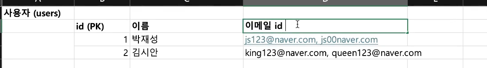
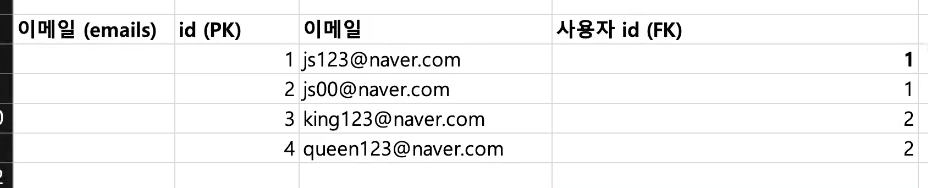

<!-- TOC -->
* [규칙 1. 한 칸에는 한 가지 정보만 들어가도록 만들어라](#규칙-1-한-칸에는-한-가지-정보만-들어가도록-만들어라)
  * [한 칸에는 한 가지 정보만!](#한-칸에는-한-가지-정보만)
  * [한 칸에 2개 이상의 정보가 들어있을 때는 테이블을 분리하면 된다](#한-칸에-2개-이상의-정보가-들어있을-때는-테이블을-분리하면-된다)
    * [사용자 이메일 예시](#사용자-이메일-예시)
    * [가게 테이블 예시](#가게-테이블-예시)
* [규칙 2. 어떤 테이블에 외래키를 넣어도 '규칙 1'을 못 지킬 때는 중간 테이블을 하나 더 만들어라](#규칙-2-어떤-테이블에-외래키를-넣어도-규칙-1을-못-지킬-때는-중간-테이블을-하나-더-만들어라)
* [규칙 3. 헷갈릴 땐 관계(1:1, 1:N, N:M)를 파악해봐라](#규칙-3-헷갈릴-땐-관계11-1n-nm를-파악해봐라)
* [규칙 4. 데이터 중복이 발생하는 컬럼이 있는지 확인해라](#규칙-4-데이터-중복이-발생하는-컬럼이-있는지-확인해라)
* [규칙 5. 가짜 중복과 진짜 중복을 구별해라](#규칙-5-가짜-중복과-진짜-중복을-구별해라)
* [규칙 6. 숨어있는 중복을 찾아라](#규칙-6-숨어있는-중복을-찾아라)
<!-- TOC -->

---

# 규칙 1. 한 칸에는 한 가지 정보만 들어가도록 만들어라

## 한 칸에는 한 가지 정보만!

## 한 칸에 2개 이상의 정보가 들어있을 때는 테이블을 분리하면 된다

### 사용자 이메일 예시

- **이렇게 한 컬럼에 데이터를 욱여넣지 말고,** 

- **테이블을 분리해서 한 컬럼에는 한 개의 데이터만 넣자**

### 가게 테이블 예시

# 규칙 2. 어떤 테이블에 외래키를 넣어도 '규칙 1'을 못 지킬 때는 중간 테이블을 하나 더 만들어라

# 규칙 3. 헷갈릴 땐 관계(1:1, 1:N, N:M)를 파악해봐라

# 규칙 4. 데이터 중복이 발생하는 컬럼이 있는지 확인해라

# 규칙 5. 가짜 중복과 진짜 중복을 구별해라

# 규칙 6. 숨어있는 중복을 찾아라

