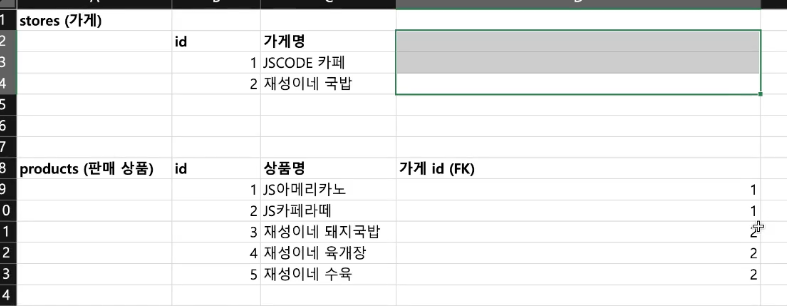

<!-- TOC -->
* [규칙 1. 한 칸에는 한 가지 정보만 들어가도록 만들어라](#규칙-1-한-칸에는-한-가지-정보만-들어가도록-만들어라)
  * [한 칸에는 한 가지 정보만!](#한-칸에는-한-가지-정보만)
  * [한 칸에 2개 이상의 정보가 들어있을 때는 테이블을 분리하면 된다](#한-칸에-2개-이상의-정보가-들어있을-때는-테이블을-분리하면-된다)
    * [사용자 이메일 예시](#사용자-이메일-예시)
    * [가게 테이블 예시](#가게-테이블-예시)
  * [심화) '한 가지 정보'라는 게 관점에 따라 달라질 수 있다.](#심화-한-가지-정보라는-게-관점에-따라-달라질-수-있다)
    * [이름 예시](#이름-예시-)
    * [전화번호 예시](#전화번호-예시)
  * [규칙 1 요약](#규칙-1-요약)
* [규칙 2. 어떤 테이블에 외래키를 넣어도 '규칙 1'을 못 지킬 때는 중간 테이블을 하나 더 만들어라](#규칙-2-어떤-테이블에-외래키를-넣어도-규칙-1을-못-지킬-때는-중간-테이블을-하나-더-만들어라)
* [규칙 3. 헷갈릴 땐 관계(1:1, 1:N, N:M)를 파악해봐라](#규칙-3-헷갈릴-땐-관계11-1n-nm를-파악해봐라)
* [규칙 4. 데이터 중복이 발생하는 컬럼이 있는지 확인해라](#규칙-4-데이터-중복이-발생하는-컬럼이-있는지-확인해라)
* [규칙 5. 가짜 중복과 진짜 중복을 구별해라](#규칙-5-가짜-중복과-진짜-중복을-구별해라)
* [규칙 6. 숨어있는 중복을 찾아라](#규칙-6-숨어있는-중복을-찾아라)
<!-- TOC -->

---

# 규칙 1. 한 칸에는 한 가지 정보만 들어가도록 만들어라

## 한 칸에는 한 가지 정보만!

## 한 칸에 2개 이상의 정보가 들어있을 때는 테이블을 분리하면 된다

### 사용자 이메일 예시

- **이렇게 한 컬럼에 데이터를 욱여넣지 말고,** 

- **테이블을 분리해서 한 컬럼에는 한 개의 데이터만 넣자**

### 가게 테이블 예시

- 설계 전

- 설계 후 (제 1정규형 적용)

## 심화) '한 가지 정보'라는 게 관점에 따라 달라질 수 있다.

### 이름 예시 

**users (사용자)**

| id | 이름  |
|----|-----|
| 1  | 박재성 |
| 2  | 김시온 |

**users (사용자)**

| id | 성 | 이름 |
|----|---|----|
| 1  | 박 | 재성 |
| 2  | 김 | 시온 |

- 누군가는 `박재성`이라는 것을 하나의 정보로 볼 수 있지만, 또 다른 누군가는 `박`이 하나의 정보고 `재성`을 또 하나의 정보로 볼 수도 있음.
- 이처럼 **한 가지 정보**라는 것은 **기준이 절대적이지 않음.**
- 즉, **서비스에 맞게 한 가지 정보로 볼지, 아닐지를 판단해야한다.**
  - 예를 들어 서비스에서 성과 이름을 따로 조회해야하는 경우가 많다면 2번째 테이블 형태로 구성하는게 좋을 것이다.
  - 그게 아니고 서비스에서 성과 이름을 따로 조회할 일이 없고 통째로 쓰는 경우만 있다면 1번째 테이블로 구성하는게 좋을 것이다. 
- 기획이 변경될 경우 데이터베이스 구조도 그에 따라 변경될 수도 있다.
  - 예를 들어 성과 이름을 따로 조회할 일이 없다가 따로 조회해야할 일이 생길 수도 있다. 항상 상황에 맞게 적용하자.

### 전화번호 예시

**stores (가게)**

| id | 전화번호       |
|----|------------|
| 1  | 0321112345 |
| 2  | 0521234567 |

**stores (가게)**

| id | 전화번호1 | 전화번호2 | 전화번호3 |
|----|-------|-------|-------|
| 1  | 032   | 111   | 2345  |
| 2  | 052   | 123   | 4567  |

- 서비스가 3가지 정보를 분리해서 따로 사용해야하는 경우가 있다면 두 번째처럼 사용해야한다.

## 규칙 1 요약

- 한 칸에는 한 가지 정보만 들어가야한다.
- 한 칸에 두 가지 이상의 정보가 들어가있을 때는, 테이블을 분리해서 외래키를 활용하면 된다.
- 특정 테이블에 외래키를 도입했을 때 규칙 1이 안지켜진다면, 다른 테이블로 외래키를 옮겨보자.
- '한 가지 정보'의 기준은 절대적이지 않다. 따라서 서비스에 맞게 판단해야한다.

# 규칙 2. 어떤 테이블에 외래키를 넣어도 '규칙 1'을 못 지킬 때는 중간 테이블을 하나 더 만들어라

# 규칙 3. 헷갈릴 땐 관계(1:1, 1:N, N:M)를 파악해봐라

# 규칙 4. 데이터 중복이 발생하는 컬럼이 있는지 확인해라

# 규칙 5. 가짜 중복과 진짜 중복을 구별해라

# 규칙 6. 숨어있는 중복을 찾아라

