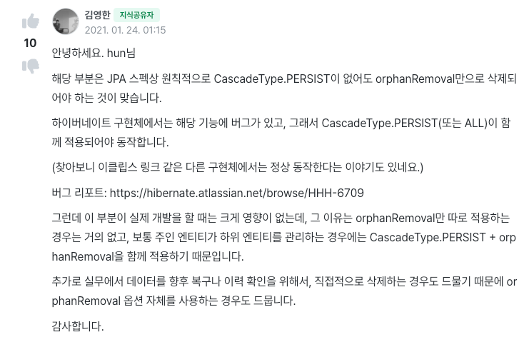

<!-- TOC -->
* [8.5 고아 객체](#85-고아-객체)
  * [orphanRemoval 옵션](#orphanremoval-옵션)
    * [orphanRemoval = false](#orphanremoval--false)
    * [orphanRemoval = true](#orphanremoval--true)
    * [(하이버네이트) orphanRemoval 옵션은 cascade 옵션과 같이써야 한다.](#하이버네이트-orphanremoval-옵션은-cascade-옵션과-같이써야-한다)
  * [고아 객체 주의점](#고아-객체-주의점)
    * [부모 제거 시 자식도 같이 제거 된다.](#부모-제거-시-자식도-같이-제거-된다)
<!-- TOC -->

# 8.5 고아 객체

- 고아 객체 제거 
  - 부모 엔티티와 연관관계가 끊어진 자식 엔티티를 자동으로 삭제하는 기능.
  - 즉, 부모 엔티티의 컬렉션에서 자식 엔티티의 참조만 제거함녀 자식 엔티티가 자동으로 삭제되는 기능이다.
- 고아 객체
  - 부모 엔티티로부터 참조가 끊긴 객체.


```java
@Entity
public class Parent {

    @Id
    @GeneratedValue(strategy = GenerationType.IDENTITY)
    @Column(name = "parent_id")
    private Long id;

    private String name;

    @OneToMany(mappedBy = "parent")
    private List<Child> children = new ArrayList<>();

    protected Parent() {
    }

    public Parent(final String name) {
        this.name = name;
    }

    public void addChild(final Child child) {
        children.add(child);
        child.setParent(this);
    }
}
```

```java
@Entity
public class Child {

    @Id
    @GeneratedValue(strategy = GenerationType.IDENTITY)
    @Column(name = "child_id")
    private Long id;

    private String name;

    @ManyToOne(fetch = FetchType.LAZY)
    @JoinColumn(name = "parent_id")
    private Parent parent;

    public Child() {
    }

    public Child(final String name) {
        this.name = name;
    }

    public void setParent(final Parent parent) {
        this.parent = parent;
    }
}
```

## orphanRemoval 옵션

### orphanRemoval = false

```java
@Entity
public class Parent {
    
    @OneToMany(mappedBy = "parent", orphanRemoval = false)
    private List<Child> children = new ArrayList<>();
}
```
```java
// 실행 로직
final Child child1 = new Child();
final Child child2 = new Child();

final Parent parent = new Parent();
parent.addChild(child1);
parent.addChild(child2);

em.persist(parent);
em.persist(child1);
em.persist(child2);

em.flush();
em.clear();

final Parent parentFound = em.find(Parent.class, parent.getId());
parentFound.getChildren().remove(0);

tx.commit(); // 트랜잭션 커밋
```
```sql
Hibernate: insert into Parent (parent_id) values (default)
Hibernate: insert into Child (parent_id,child_id) values (?,default)
Hibernate: insert into Child (parent_id,child_id) values (?,default)
Hibernate: select p1_0.parent_id from Parent p1_0 where p1_0.parent_id=?
Hibernate: select c1_0.parent_id,c1_0.child_id from Child c1_0 where c1_0.parent_id=?
```

- orphanRemoval=false 일 경우, 부모 엔티티로부터 연관관계가 끊어졌다하더라도 엔티티가 자동으로 삭제되지는 않는다.

### orphanRemoval = true

```java
@Entity
public class Parent {
    
    @OneToMany(mappedBy = "parent", orphanRemoval = true)
    private List<Child> children = new ArrayList<>();
}
```

- 위 처럼 옵션을 주고 다시 로직을 실행하면? 

```java
Hibernate: insert into Parent (parent_id) values (default)
Hibernate: insert into Child (parent_id,child_id) values (?,default)
Hibernate: insert into Child (parent_id,child_id) values (?,default)
Hibernate: select p1_0.parent_id from Parent p1_0 where p1_0.parent_id=?
Hibernate: select c1_0.parent_id,c1_0.child_id from Child c1_0 where c1_0.parent_id=?
```

- 어라. **분명 JPA 책에서는 DELETE 쿼리가 수행된다고 나와있는데 실제로는 그렇지 않다.**

### (하이버네이트) orphanRemoval 옵션은 cascade 옵션과 같이써야 한다.

> [orphanRemoval과 cascade의 관계](https://www.inflearn.com/community/questions/137740)



- 그렇다. 하이버네이트 구현체에는 버그로 인해 orphanRemoval 옵션만 가지고는 고아 객체가 삭제되지 않는다.

```java

@Entity
public class Parent {

    @OneToMany(mappedBy = "parent", cascade = CascadeType.PERSIST, orphanRemoval = true)
    private List<Child> children = new ArrayList<>();
}
```
```java
final Child child1 = new Child();
final Child child2 = new Child();

final Parent parent = new Parent();
parent.addChild(child1);
parent.addChild(child2);

em.persist(parent); // 영속성 전이로 인해 자식 엔티티도 함께 저장.

em.flush();
em.clear();

final Parent parentFound = em.find(Parent.class, parent.getId());
parentFound.getChildren().remove(0);

tx.commit(); // 트랜잭션 커밋
```
```sql
Hibernate: insert into Parent (parent_id) values (default)
Hibernate: insert into Child (parent_id,child_id) values (?,default)
Hibernate: insert into Child (parent_id,child_id) values (?,default)
Hibernate: select p1_0.parent_id from Parent p1_0 where p1_0.parent_id=?
Hibernate: select c1_0.parent_id,c1_0.child_id from Child c1_0 where c1_0.parent_id=?
Hibernate: delete from Child where child_id=?
```

- Cascade 옵션과 같이 orphanRemoval을 사용하면 부모 엔티티의 컬렉션에서 자식 엔티티의 참조만 제거해도 자식 엔티티가 자동으로 삭제되는 것을 확인할 수 있다.

## 고아 객체 주의점

- 참조하는 곳이 하나일 때 사용해야한다. (그냥 사용하지 말자.)
  - 예) 게시판의 첨부파일 등.
- 특정 엔티티가 개인 소유할 때 사용. (그냥 사용하지 말자.)

### 부모 제거 시 자식도 같이 제거 된다.

- 참고: 개념적으로 부모를 제거하면 자식은 고아가 된다, 따라서 고아 객체 제거 기능을 활성화하면, 부모 제거시 자식도 같이 제거된다. (즉 `CascadeType.REMOVE`처럼 동작한다.)

```java
@Entity
public class Parent {

  @OneToMany(mappedBy = "parent", cascade = CascadeType.PERSIST, orphanRemoval = true)
  private List<Child> children = new ArrayList<>();
}
```
```java
final Child child1 = new Child();
final Child child2 = new Child();

final Parent parent = new Parent();
parent.addChild(child1);
parent.addChild(child2);

em.persist(parent); // 영속성 전이로 인해 자식 엔티티도 함께 저장.

em.flush();
em.clear();

final Parent parentFound = em.find(Parent.class, parent.getId());
em.remove(parentFound); // 부모 제거

tx.commit(); // 트랜잭션 커밋
```
```sql
Hibernate: insert into Parent (parent_id) values (default)
Hibernate: insert into Child (parent_id,child_id) values (?,default)
Hibernate: insert into Child (parent_id,child_id) values (?,default)
Hibernate: select p1_0.parent_id from Parent p1_0 where p1_0.parent_id=?
Hibernate: select c1_0.parent_id,c1_0.child_id from Child c1_0 where c1_0.parent_id=?
Hibernate: delete from Child where child_id=?
Hibernate: delete from Child where child_id=?
Hibernate: delete from Parent where parent_id=?
```

- 쿼리를 확인해보면 부모만 제거했는데, 고아 객체 제거 옵션이 사용되고 있으므로 자식 엔티티도 같이 삭제되었다.

