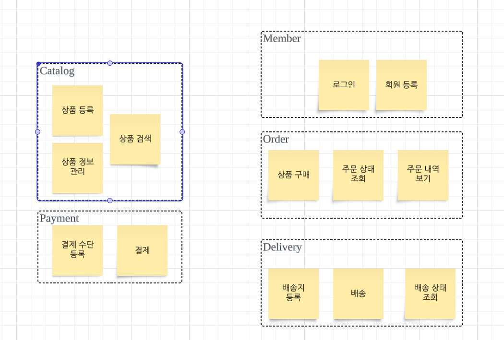

# 프로젝트 요구사항 분석 및 정리

- 요약: 온라인으로 상품을 등록하고 판매하는 e-commerce 시스템. 다량의 데이터와 높은 동시접속자 수 환경에서 안정적으로 요청을 처리할 수 있다.

## 요구사항 수집

### 판매자

- 판매자는 상품을 등록할 수 있다.
- 판매자는 상품의 설명, 수량 등 정보를 관리할 수 있다.

### 구매자

- 구매자는 상품을 구매할 수 있다.
- 구매자는 상품을 검색할 수 있다.
- 구매자는 결제수단을 등록하고 주문 시  사용할 수 있다.
- 구매자는 배송지를 등록하고 주문 시 사용할 수 있다.
- 구매자는 완료된 주문의 배송 상태를 조회할 수 있다.
- 구매자는 주문 내역 리스트를 볼 수 있다.
- 구매자는 회원으로 등록할 수 있다.
- 회원은 로그인을 할 수 있다.

> _"초반에는 모든 케이스를 커버할 수 없기 때문에, 큰 단위로 정해놓고 살을 붙여나가면서 커버하자."_ 

# 상위 수준 설계(주요 컴포넌트)

## 서비스

- Catalog
  - 역할: 상품 정보 관리
  - 기능
    - 상품 등록
    - 상품 수정
    - 상품 수량 관리
    - 상품 조회
    - 상품 검색
- Payment
    - 역할: 결제 처리와 관련된 작업
    - 기능:
        - 결제 수단 등록
        - 결제 수단 변경
        - 결제
        - 결제 결과 조회
- Order
    - 역할: 주문 처리를 수행하고 상태를 관리
    - 기능:
        - 상품 주문
        - 주문 상태 조회
        - 주문 내역 보기
        - 배송 상태 조회 <- 이 부분이 조금 애매하다. 실제로는 Delivery 서비스가 배송 상태 조회를 담당 하지만, Order쪽에서 가져다 쓰는 느낌으로 작업.
- Delivery
    - 역할: 주문 완료된 제품 배송, 상태 관리
    - 기능
        - 배송지 등록
        - 배송 처리
        - 배송 상태 조회
- Member
  - 역할: 회원 등록 관리와 인증
  - 기능
      - 회원 등록
      - 회원 정보 관리

# 하위 수준 설계(각 컴포넌트 별 인터페이스)

# 아키텍처 고려사항을 설계에 적용하기
