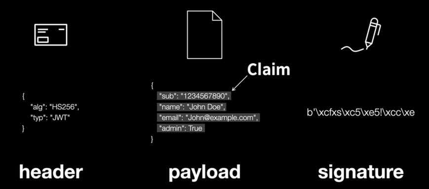
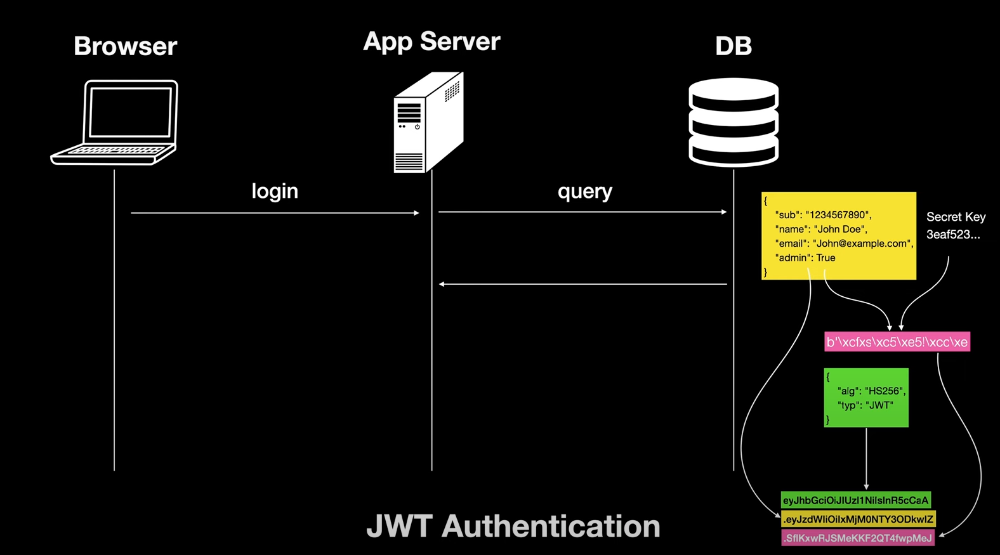
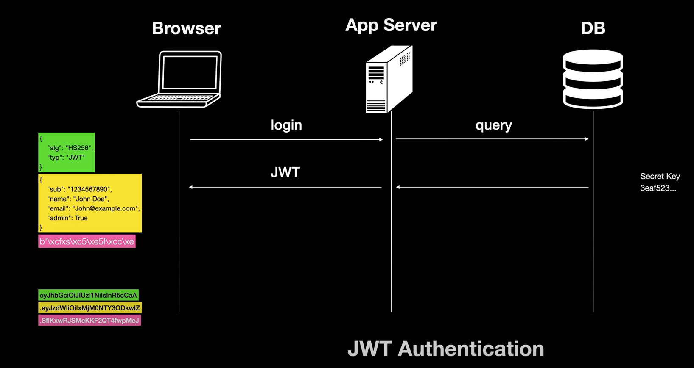
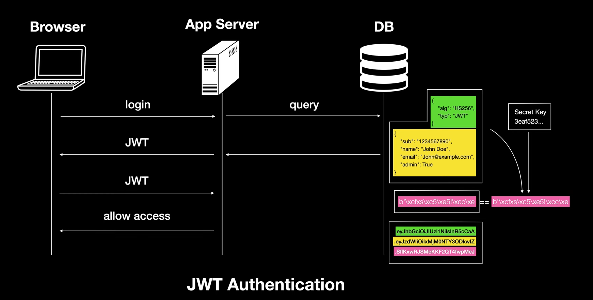
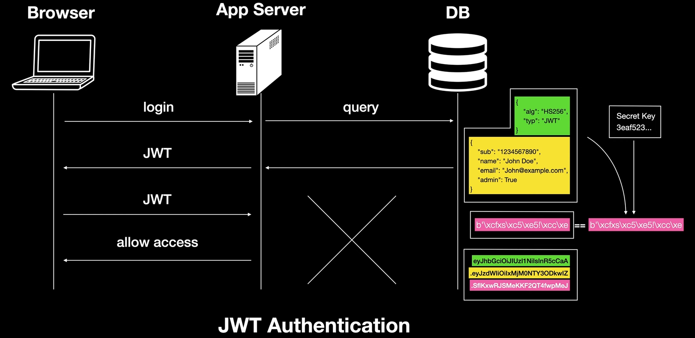

# 참고

> - 얄코: https://www.youtube.com/watch?v=1QiOXWEbqYQ
> - 생활코딩: https://www.youtube.com/watch?v=36lpDzQzVXs
> - [우리는 왜 JWT를 사용하는가? / JWT 사용 이유](https://puleugo.tistory.com/138)

<!-- TOC -->
* [참고](#참고)
* [JWT](#jwt)
  * [header](#header)
    * [type](#type)
    * [alg](#alg)
  * [payload](#payload)
    * [Claim](#claim)
    * [변조 위험](#변조-위험)
  * [verify signature ⭐️ (JWT의 핵심)](#verify-signature--jwt의-핵심)
    * [서명의 원리 - 내가 인증(서명)했다는 것을 어떻게 보장하지?](#서명의-원리---내가-인증서명했다는-것을-어떻게-보장하지)
* [쿠키 Vs. JWT](#쿠키-vs-jwt)
  * [Cookie-based Session Management](#cookie-based-session-management)
    * [세션 방식의 단점](#세션-방식의-단점)
  * [JWT 인증 방식](#jwt-인증-방식)
    * [서버가 JWT를 발급하는 과정](#서버가-jwt를-발급하는-과정)
    * [JWT 장점 1: 서버에 다시 접속하지 않아도 돼](#jwt-장점-1-서버에-다시-접속하지-않아도-돼)
    * [서버가 전달 받은 JWT를 인증하는 방법](#서버가-전달-받은-jwt를-인증하는-방법)
    * [JWT 장점 2: 로그인할 때 한 번만 DB에 접속한다.](#jwt-장점-2-로그인할-때-한-번만-db에-접속한다)
* [세션과 JWT](#세션과-jwt)
  * [stateful Vs. stateless](#stateful-vs-stateless)
  * [JWT는 세션을 대체할 수 있는가?](#jwt는-세션을-대체할-수-있는가)
* [JWT를 쓸만한 서비스인지를 따져보라](#jwt를-쓸만한-서비스인지를-따져보라)
* [JWT의 단점은?](#jwt의-단점은)
* [인증과 인가](#인증과-인가)
  * [어떤 사이트나 서비스에 사용자가 로그인해있다는 사실을 서버가 어떻게 인지할까](#어떤-사이트나-서비스에-사용자가-로그인해있다는-사실을-서버가-어떻게-인지할까)
    * [전통적인 방식 - 세션](#전통적인-방식---세션)
* [궁금하다 궁금해](#궁금하다-궁금해)
  * [Secret Key](#secret-key)
    * [Secret Key 란?](#secret-key-란)
    * [Secret Key는 어떻게 만들까? 어떻게 만들어야할까?](#secret-key는-어떻게-만들까-어떻게-만들어야할까-)
    * [Secret Key는 어디에 저장해야할까?](#secret-key는-어디에-저장해야할까)
    * [Secret Key룰 탈취 당하면 어떻게 해야할까?](#secret-key룰-탈취-당하면-어떻게-해야할까)
  * [Access Token / Refresh Token?](#access-token--refresh-token)
  * [토큰은 어디에다 저장해야할까?](#토큰은-어디에다-저장해야할까)
<!-- TOC -->

---


# JWT




- header, payload, verify signature 로 구성

## header

- header를 Base64 디코딩해보면 2가지 정보(type, arg)가 담겨있다.

### type

- type은 'jwt' 고정.

### alg

- 서명값(signature)를 만드는데 사용되는 알고리즘이 지정된다.
  - HS256 등..
- 1번 header와 2번 payload, 그리고 서버에 감춰놓은 비밀 값 이 셋을 암호화 알고리즘에 넣고 돌리면 서명값이 나오는다.
- 암호화 알고리즘이 단방향으로는 계산이 되어도 반대쪽으로는 안 되는거라서, 서버만 알고 있는 값을 비밀값을 찾아낼 방법이 없음.
  - 2번 payload를 조작해도 3번 signature가 달라져버리므로 조작이 불가.
- 3번 서명 값과 계산값이 일치하고, 유효기간도 지나지 않았다면 그 사용자는 로그인 된 회원으로서 인가를 받는다.


## payload


- payload의 각 부분을 `Claim(주장)` 이라고한다.
  - 왜 주장이라고 할까? 👉 **페이로드의 내용을 곧이 곧대로 믿을 수 없기 때문.**
    - 이 주장을 믿을 수 있는 방법이 `서명`이다.
      - 서명만 있으면 이 내용이 누가 보낸 것인지 확신할 수 있다.

### Claim

- Base64로 디코딩 하면 JSON 형태로 여러 정보들이 담겨 있음
  - 이 토큰을 누가 누구에게 발급했는지
  - 이 토큰이 언제까지 유효한지 
  - 서비스가 사용자에게 이 토큰을 통해 공개하기 원하는 내용
    - 사용자의 닉네임
    - 서비스상의 레벨
    - 관리자 여부
- 위 같은 정보들을 서비스 측에 원하는대로 토큰에 담을 수 있다.
- 토큰에 담긴 사용자 정보등의 데이터를 `Claim`이라고 함.

### 변조 위험

- admin값을 true로 변조하는 등의 위험이 있음
- 👉 그래서 header와 signature가 있는 것임.

## verify signature ⭐️ (JWT의 핵심)

- signature
  - 헤더와 페이로드, 시크릿 키를 헤더에서 제공한 알고리즘(=header.alg. `HS256` 등)
- 페이로드를 조작하면 생성한 signature 값이 달라지게 된다.

### 서명의 원리 - 내가 인증(서명)했다는 것을 어떻게 보장하지?

- 왼쪽에 있는 사람을 A, 오른쪽에 있는 사람을 B라 하자.
- B가 먼 훗날 이 내용들(header, payload, signature)를 받으면, 이것을 B가 발급한 토큰임을 증명할 수 있을까?
- 왜? secret key를 가지고 있는 것은 B뿐이니까!

---

# 쿠키 Vs. JWT

## Cookie-based Session Management


### 세션 방식의 단점

1. **사용자의 정보(유저 이름 등)를 알기 위해서는 서버에 조회를 다시해야한다.**
   - `session id`에는 그런 정보는 포함되어 있지 않기 때문
2. **서버에 접속할 때마다 세션 테이블을 확인해야한다.**
  - 사용자가 새로운 장치로 접속할 때마다, 세션 ID가 다시 생겨야하기 때문에 세션 테이블에 너무 많은 쓰기 작업 & 데이터가 너무 많이 쌓인다.(데이터베이스가 혹사 당함)
 

## JWT 인증 방식

### 서버가 JWT를 발급하는 과정



- 페이로드를 secret key와 함께 헤더의 알고리즘을 이용하여 서명을 만든다.
- 헤더, 페이로드, 서명을 각각 base64로 인코딩하고(인터넷을 통해 안전하게 전달하기위해), `.`으로 연결하여 브라우저로 전달한다.
  - **이 토큰값은 인증 직후에 서버가 발행한 값이기 때문에, 이 JWT를 가지고 있다라는 것은 곧 로그인한 적이 있는 사람이라는 징표가 된다.**
- 클라이언트는 토큰을 쿠키나 로컬 스토리지에 저장한다.

### JWT 장점 1: 서버에 다시 접속하지 않아도 돼



- 토큰을 Base64로 디코딩하면 원래의 데이터로 되돌릴 수 있다.
  - JWT는 메시지를 담는 '수단'이므로, payload에 애플리케이션에서 자주 쓰는 정보를 담아두기에 좋다.
    - 이 정보를 가져오기 위해서 **서버에 다시 접속하지 않아도 되기 때문에 서버의 부담을 완화할 수 있다.**

### 서버가 전달 받은 JWT를 인증하는 방법



- 클라이언트는 JWT를 서버로 전달한다.
- 서버는 자신의 secret key를 이용하여 header의 알고리즘으로 payload를 '서명'하고, 그 서명이 클라이언트로부터 넘겨받은 서명과 비교한다.
  - 그 서명이 일치하면, 이 클라이언트는 이전에 이 앱 서버에 로그인한 적 있는 클라이언트라는 것이 틀림없다.
- 이렇게 인증에 성공하면, 사용자가 원하는 작업을 처리해준다. (그림의 `allow access`)   

### JWT 장점 2: 로그인할 때 한 번만 DB에 접속한다.



- JWT를 사용하면 로그인할 때 처음 한 번만 DB에 접속한다.
- 그 이후 확인과정에서는 데이터베잇으에 접속을 할 필요가 없다.
  - 당연히 세션 테이블이 필요없다. JWT 토큰만으로 인증이 끝나니까.
- 👉 데이터베이스를 사용하지 않기 때문에, 획기적으로 DB의 부담을 줄여준다.

---

<br>

# 세션과 JWT

## stateful Vs. stateless

- 서버는 사용자들의 상태를 어디다가 따로 저장하는 것이 아니고, 요청이 들어올 때마다 시그니처만 비교하면 된다.
  - 시간에 따라 바뀌는 어떤 상태값을 '안' 가지므로 `stateless`
- 세션은 사용자의 정보(=시간에 따라 바뀌는 상태값)를 저장했다가 비교하므로  `stateful`

<br>

## JWT는 세션을 대체할 수 있는가?

- 세션을 대체하기에는 큰 단점이 있음.
- 세션처럼 stateful해서, 모든 사용자의 상태를 기억하고 있다는 것이 큰 부담이 되는 것은 맞음. (단점)
  - 👉 but, 구현되기만 하면 기억하는 대상의 상태들을 언제든 제어할 수 있게된다. (장점)
 
### 한 기기에서만 로그인 가능한 서비스를 만드려는 경우에는 세션으로!

 - 한 기기에서만 로그인 가능한 서비스를 만든다고 해보자. 예를 들면 강의 사이트 같은 것.
 - (세션을 사용할 경우) 사용자가 모바일에서 로그인할 때 PC에서 또 로그인하면, 기존 모바일에서는 로그아웃 되도록 기존 세션을 종료할 수 있다.
 - JWT에서는 이게 안 된다. 이미 내줘버린 토큰을 어찌할 방법이 없으니까. (= 서버에서 그 정보를 '추적'하고 있지 않으니까 = `stateless`)

<br>

## JWT의 보안상 약점

- 토큰이 해커에게 탈취당했을 경우, 이 해커가 가져간 JWT를 무효화할 방법이 없다. (`stateless`하니까!) 
  - 따라서, 실 서비스 중에 JWT만으로 인가를 구현하는 곳은 그렇게 많지 않다.

### 보완하는 방법 

- JWT 보안상 약점을 보완하는 방법이 있다.
- **만료시간을 가깝게 잡아서 토큰의 수명을 아주 짧게 만든다.**
  - 그런데 이 방법은 자주 로그인 해야하는 불편함이 있음
- 👉 로그인할 때 토큰을 2개 내려준다. `accessToken`과 `refreshToken`
  - 수명이 몇 시간이나 몇 분이하로 짧은 accessToken,
  - 꽤 길게, 보통은 2주 정도로 수명이 잡혀있는 refreshToken을 내려준다.
- accessToken과 refreshToken을 이용한 인증/인가 구현 방법 중 하나를 소개한다.
  1. accessToken과 refreshToken을 발급하여 클라이언트에게 보내고 나서, refreshToken의 상응값은 DB에도 저장한다.
  2. 클라이언트는 accessToken의 수명을 다하면 refreshToken을 보낸다. 
  3. 서버는 받은 refreshToken을 DB의 상응값과 대조해보고, 맞다면 새 accessToken을 발급해준다.
- 👉 이 refreshToken만 안전하게 관리된다면, 이게 유효할 동안은 accessToken이 만료될 때마다 다시 로그인할 필요없이 새로 accessToken을 발급받을 수 있게된다.
- 👉 중간에 accessToken이 **탈취당해도 오래쓰지는 못한다.**(수명이 짧으니까.)
  - 누군가를 강제 로그아웃 시키려면 refreshToken을 DB에서 삭제하여 토큰 갱신이 안 되게 하면 된다.
  - 그럼에도 불구하고 아주 짧은 시간 동안 토큰이 탈취당했을 때, accessToken이 살아있는 동안 인가를 막을 방법은 없다.
    - 👉 이것이 현재 JWT의 한계이기는함.
  

# JWT를 쓸만한 서비스인지를 따져보라

- JWT를 사용한 구현 방식은 accessToken을 탈취 당했을 때 아주 짧은 시간이기는 하지만, 인가를 허용하게 된다는 단점이 있다.
- 따라서, JWT를 적용하기 전에 우선 내 서비스가 JWT를 적용하기 적합한 서비스인지 따져볼 필요가 있다. 
- 위 문제가 큰 이슈가 안 되는 종류의 서비스에서는 편리하고 경제적인 인가 방식이 된다.

> (GPT4 답변) 
> ```text
> 그런데도 분명히 JWT는 경제적인 인증 인가 방식이야.
> 위 같은 보안 문제가 발생해도 괜찮은 서비스에는 적용해도 괜찮을 것 같은데, 내 생각이 맞을까?
> 
> 또, JWT를 적용하기 좋은 서비스들이 뭐가 있을까?
> ```
> 네, 맞습니다. JWT는 상태를 서버 측에서 관리하지 않아도 되는 Stateless한 특성 때문에 서버 자원을 효율적으로 사용할 수 있어 경제적인 인증 인가 방식 중
> 하나입니다. 이러한 특성 때문에 확장성이 높은 서비스나, 분산 시스템 환경에서 매우 유용하게 사용됩니다.
> 
> 비록 보안 문제가 존재하지만, 적절한 보안 조치와 함께 사용한다면 많은 서비스에서 충분히 활용할 수 있습니다. 특히 다음과 같은 상황에서 JWT를 사용하는 것이 적합할 수 
> 있습니다:
>
> - 단일 페이지 어플리케이션(SPA): SPA에서는 서버로부터 데이터를 비동기적으로 요청하며, 사용자 인증 정보를 매 요청마다 포함시켜야 합니다. JWT는 이러한 환경에서 
   > 사용자 인증 정보를 효율적으로 관리할 수 있는 방법을 제공합니다. 
> - 모바일 어플리케이션: 모바일 환경에서도 사용자의 인증 정보를 효과적으로 관리해야 하는데, JWT는 모바일 디바이스와 서버 간의 인증 정보를 손쉽게 주고받을 수 있는 
   > 수단을 제공합니다. 
> - 마이크로서비스 아키텍처: 마이크로서비스 환경에서는 여러 서비스 간에 사용자 인증 정보를 공유해야 할 필요가 있습니다. JWT는 이러한 환경에서 인증 정보를 간편하게 
   > 전달하고 검증할 수 있는 방법을 제공합니다.
> - 임시 접근 제어: 예를 들어, 사용자가 특정 기간 동안만 임시로 접근 권한을 부여받아야 하는 경우, JWT는 해당 접근 권한의 유효 기간을 쉽게 설정하고 관리할 수 있게 
>   해줍니다.
> - 서버리스 환경: 서버리스 아키텍처에서는 서버 자원의 관리가 최소화되며, 사용자의 요청을 기반으로 동적으로 리소스가 할당됩니다. JWT는 이러한 환경에서 사용자 인증을 간단하고 효율적으로 처리할 수 있는 방법을 제공합니다.
> 
> 물론, JWT를 사용할 때는 앞서 언급한 보안 문제를 적극적으로 관리하고, 특히 토큰의 안전한 저장과 전송, 유효 기간 관리, 적절한 암호화 방식의 사용 등을 신경 
   > 써야 합니다. 보안이 중요한 서비스에서는 추가적인 보안 조치와 함께 JWT를 사용하는 것이 좋습니다.

---

# 궁금하다 궁금해

## Secret Key

### Secret Key 란?

### Secret Key는 어떻게 만들까? 어떻게 만들어야할까? 

### Secret Key는 어디에 저장해야할까?

### Secret Key룰 탈취 당하면 어떻게 해야할까?

## Access Token / Refresh Token?

## 토큰은 어디에다 저장해야할까?

- 쿠키?
- 로컬 스토리지?
- DB..? ahh..?

