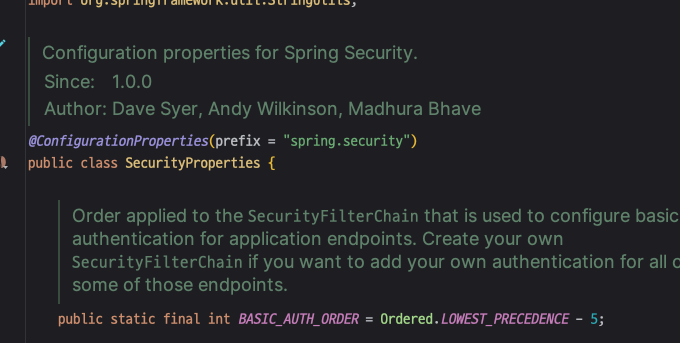

<!-- TOC -->
* [자동설정에 의한 기본 보안 작동](#자동설정에-의한-기본-보안-작동-)
  * [기본 유저 정보](#기본-유저-정보)
    * [그럼 어디서 기본 유저 정보를 초기화 하지?](#그럼-어디서-기본-유저-정보를-초기화-하지)
  * [기본 웹 처리](#기본-웹-처리)
<!-- TOC -->

# 자동설정에 의한 기본 보안 작동 

## 기본 유저 정보

- `localhost:8080` 입력 시 `localhost:8080/login`으로 리다이렉트 된다.

- 처음 컨테이너가 뜰 때 제공한 비밀번호로 로그인한 화면

### 그럼 어디서 기본 유저 정보를 초기화 하지?

- `SecurityProperties`가 그 역할을 수행하고 있음.

- `SecurityProperties.User` 클래스를 살펴보면 name과 password를 갖고 있음.
- 그런데 이 정보를 DB에 저장하진 않을 것이므로, 메모리에 저장될 것이고, 이 메모리에 초기화 해놓는 녀석이 따로 있을 것이다.
  - `getName()`과 `getPassword()`에 브레이크 포인트를 걸고 디버깅해보자. (스프링 컨테이너 재시작)

- `UserDetailsServiceAutoConfiguration.inMemoryUserDetailsManager`에서  `getName()`을 호출하고 있다.

## 기본 웹 처리

- `SpringBootWebSecurityConfiguration`에서 기본 웹 구문을 설정하기 위한 빈이 생성된다.
- 그런데 이 빈은 조건을 만족시킬 때만 생성이된다.

- `@ConditionalOnDefaultWebSecurity`에 따라 `SpringBootWebSecurityConfiguration.
  defaultSecurityFilterChain`이 실행될지 말지 결정된다.
- `@ConditionalOnDefaultWebSecurity`는 `DefaultWebSecurityCondition`의 조건에 의존한다.

- `@ConditionalOnClass({ SecurityFilterChain.class, HttpSecurity.class })`
  - SecurityFilterChain과 HttpSecurity가 클래스 패스에 있어야 참이 된다.
  - 스프링 시큐리티 의존성만 추가해줘도 이 부분은 만족한다.
- `@ConditionalOnMissingBean({ SecurityFilterChain.class })`
  - SecurityFilterChain 이 생성되어 있지 않을 때 참이다. (On Missing Bean이니까. 생성되어있다면 거짓.)
  - 그런데 우린 지금 SecurityFilterChain를 만든 적이 없다. 즉 SecurityFilterChain이 생성되어있지 않으므로 이 조건 역시 참이다.

