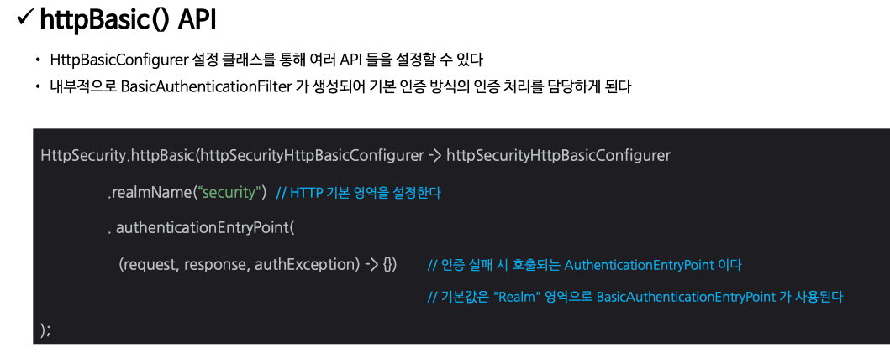
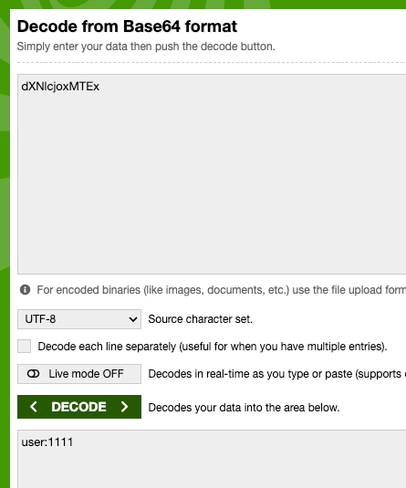

<!-- TOC -->
* [자동설정에 의한 기본 보안 작동](#자동설정에-의한-기본-보안-작동-)
  * [기본 유저 정보](#기본-유저-정보)
    * [그럼 어디서 기본 유저 정보를 초기화 하지?](#그럼-어디서-기본-유저-정보를-초기화-하지)
  * [기본 웹 처리](#기본-웹-처리)
<!-- TOC -->

# 자동설정에 의한 기본 보안 작동 

## 기본 유저 정보

- `localhost:8080` 입력 시 `localhost:8080/login`으로 리다이렉트 된다.

- 처음 컨테이너가 뜰 때 제공한 비밀번호로 로그인한 화면

### 그럼 어디서 기본 유저 정보를 초기화 하지?

- `SecurityProperties`가 그 역할을 수행하고 있음.

- `SecurityProperties.User` 클래스를 살펴보면 name과 password를 갖고 있음.
- 그런데 이 정보를 DB에 저장하진 않을 것이므로, 메모리에 저장될 것이고, 이 메모리에 초기화 해놓는 녀석이 따로 있을 것이다.
  - `getName()`과 `getPassword()`에 브레이크 포인트를 걸고 디버깅해보자. (스프링 컨테이너 재시작)

- `UserDetailsServiceAutoConfiguration.inMemoryUserDetailsManager`에서  `getName()`을 호출하고 있다.

## 기본 웹 처리

- `SpringBootWebSecurityConfiguration`에서 기본 웹 구문을 설정하기 위한 빈이 생성된다.
- 그런데 이 빈은 조건을 만족시킬 때만 생성이된다.

- `@ConditionalOnDefaultWebSecurity`에 따라 `SpringBootWebSecurityConfiguration.
  defaultSecurityFilterChain`이 실행될지 말지 결정된다.
- `@ConditionalOnDefaultWebSecurity`는 `DefaultWebSecurityCondition`의 조건에 의존한다.

- `@ConditionalOnClass({ SecurityFilterChain.class, HttpSecurity.class })`
  - SecurityFilterChain과 HttpSecurity가 클래스 패스에 있어야 참이 된다.
  - 스프링 시큐리티 의존성만 추가해줘도 이 부분은 만족한다.
- `@ConditionalOnMissingBean({ SecurityFilterChain.class })`
  - SecurityFilterChain 이 생성되어 있지 않을 때 참이다. (On Missing Bean이니까. 생성되어있다면 거짓.)
  - 그런데 우린 지금 SecurityFilterChain를 만든 적이 없다. 즉 SecurityFilterChain이 생성되어있지 않으므로 이 조건 역시 참이다.

---

# SecurityBuilder / SecurityConfigurer

- 스프링 시큐리티는 초기화 시에 인증/인가와 관련된 많은 작업을 한다. 
  - 객체 생성, 설정 등.
- 대부분의 초기화 작업은 SecurityBuilder / SecurityConfigurer 두 클래스에 의해 동작한다. 
- 따라서 SecurityBuilder / SecurityConfigurer 를 잘 이해하고 있으면 시큐리티 전반적인 이해도가 올라간다.

## 개념

- SecurityBuilder는 빌더 클래스로서 웹 보안을 담당하는 `빈 객체`와 `설정 클래스`들을 설정하는 역할
  - 대표적으로 WebSecurity, HttpSecurity 가 존재.
- `SecurityConfigurer`는 http 요청과 관련된 보안처리를 담당하는 필터를 생성 & 여러 초기화 설정에 관여.
- SecurityBuilder는 SecurityConfigurer를 참조하고 있으며, 인증/인가 초기화 작업은 SecurityConfigurer에 의해 진행됨.

- 자동 설정에 의해 HttpSecurity 빈 생성 
- SecurityConfigurer 가 Filter를 생성

## 소스 코드 분석

- SecurityBuilder: 객체를 생성하기 위한 인터페이스

# WebSecurity / HttpSecurity

## HttpSecurity 

- HttpSecurityConfiguration 에서 HttpSecurity 를 생성하고 초기화 진행.
- HttpSecurity는 보안에 필요한 각 설정 클래스와 필터를 생성하고 최종적으로 `SecurityFilterChain` 빈 생성
  - HttpSecurity 의 최종 목적은 빈을 생성하는 것.

- `build()` 이후 `SecurityFilterChain` 이 인증/인가에 필요한 필터들을 갖게된다.
- 디버깅 사진을 보면 구현체인 `DefaultSecurityFilterChain`이 확인된다.

- `matches(HttpServletRequest request)`
  - `SecurityFilterChain`은 여러 개가 생성될 수 있음.
  - `matches()` 는 이 필터 체인에 의해 처리해야한다는 것을 의미함.

## WebSecurity

- WebSecurityConfiguration 에서 WebSecurity 를 생성하고 초기화를 진행한다.
- WebSecurity 는 HttpSecurity 에서 생성한 SecurityFilterChain 빈을 SecurityBuilder 에 저장한다.
- WebSecurity 가 build() 를 실행하면 SecurityBuilder 에서 SecurityFilterChain 을 꺼내어 FilterChainProxy 
  생성자에게 전달한다.
- 즉 WebSecurity 는 HttpSecurity 보다 상위 개념이며, HttpSecurity가 생성한 빈인 SecurityFilterChain를 
  FilterChainProxy에 저장하는 역할
- 즉 이 모든 것은 FilterChainProxy가 SecurityFilterChain 을 갖게하기 위한 과정이었음. 

## 실습

### HttpSecurityConfiguration.httpSecurity()

- HttpSecurityConfiguration -> HttpSecurity 생성

## 웹 요청을 처리하는 주체
 
- SecurityFilterChain 자체가 웹 요청을 처리하는 것이 아니다.
- **웹 요청을 처리하는 주체는 WebSecurity가 만드는 FilterChainProxy 이다.**

# DelegatingFilterProxy / FilterChainProxy
# 사용자 정의 보안 설정하기

