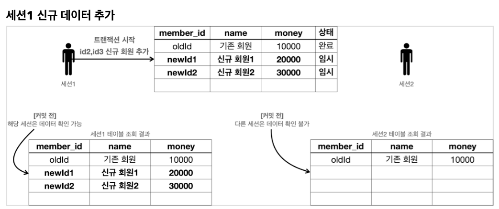
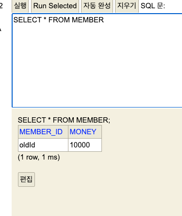
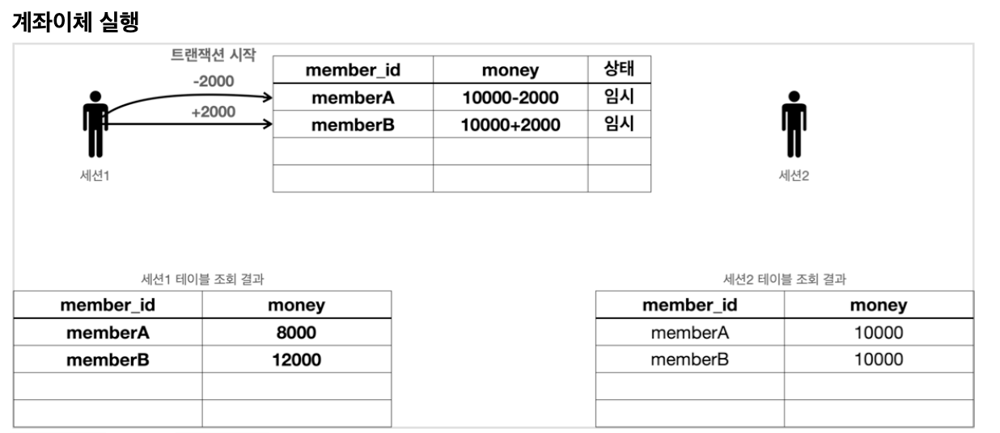
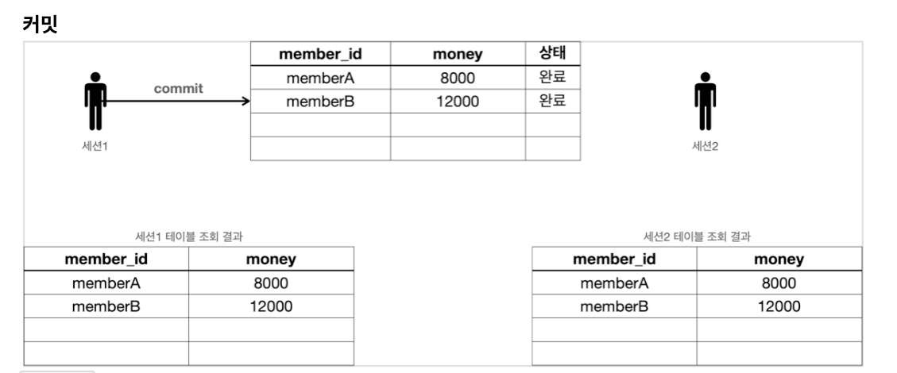
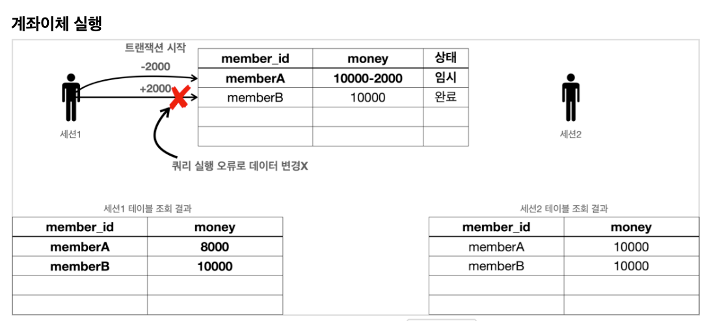
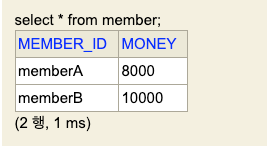
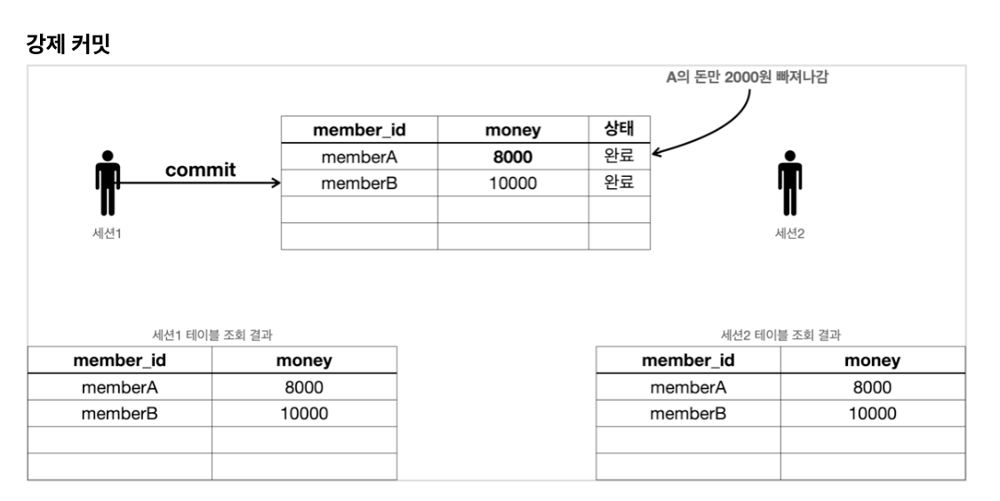
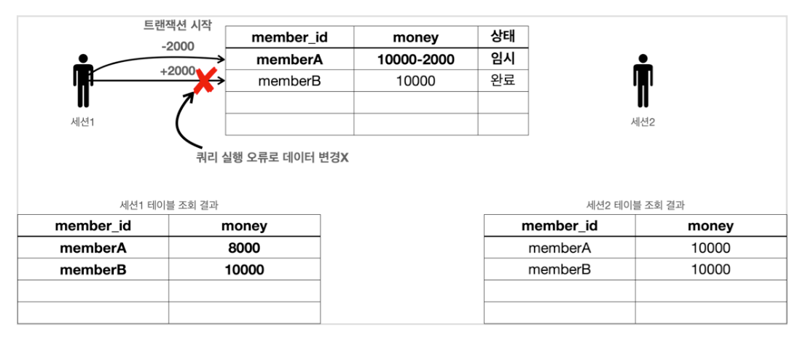
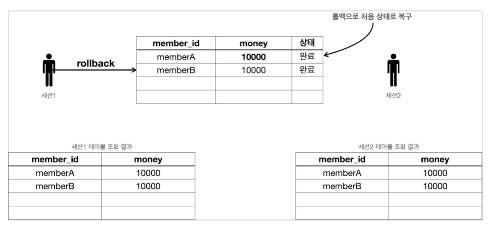

<!-- TOC -->
* [트랜잭션](#트랜잭션-)
  * [트랜잭션 개념 이해](#트랜잭션-개념-이해)
  * [데이터베이스 연결 구조와 DB 세션](#데이터베이스-연결-구조와-db-세션)
* [트랜잭션 DB 예제](#트랜잭션-db-예제)
  * [Member DDL](#member-ddl)
* [트랜잭션 DB 예제 01 - 개념 이해](#트랜잭션-db-예제-01---개념-이해)
* [트랜잭션 DB 예제 02 - 자동 커밋, 수동 커밋](#트랜잭션-db-예제-02---자동-커밋-수동-커밋)
  * [자동 커밋](#자동-커밋)
  * [수동 커밋](#수동-커밋)
* [트랜잭션 DB 예제 03 - 트랜잭션 실습](#트랜잭션-db-예제-03---트랜잭션-실습)
* [트랜잭션 DB 예제 04 - 계좌 이체](#트랜잭션-db-예제-04---계좌-이체)
  * [계좌이체 정상 케이스](#계좌이체-정상-케이스)
  * [계좌이체 문제 상황 - 커밋](#계좌이체-문제-상황---커밋)
    * [문제가 발생하는 SQL](#문제가-발생하는-sql)
    * [강제 커밋 시 A의 돈만 날라간다](#강제-커밋-시-a의-돈만-날라간다)
  * [계좌이체 문제 상황 - 롤백](#계좌이체-문제-상황---롤백)
    * [기본 데이터 입력 SQL](#기본-데이터-입력-sql)
    * [정리 (원자성, 오토 커밋, 트랜잭션 시작)](#정리-원자성-오토-커밋-트랜잭션-시작)
    * [계좌이체 실행](#계좌이체-실행)
    * [계좌이체 실행 SQL - 오류](#계좌이체-실행-sql---오류)
    * [두 번째 SQL 실행시 발생하는 오류 메시지](#두-번째-sql-실행시-발생하는-오류-메시지)
    * [롤백!!!](#롤백-)
* [트랜잭션 정리](#트랜잭션-정리-)
  * [원자성](#원자성)
  * [오토 커밋](#오토-커밋)
  * [트랜잭션 시작](#트랜잭션-시작-)
* [DB 락 - 개념 이해](#db-락---개념-이해)
* [DB 락 - 변경](#db-락---변경)
* [DB 락 - 조회](#db-락---조회)
* [트랜잭션 - 적용 1](#트랜잭션---적용-1)
* [트랜잭션 - 적용 2](#트랜잭션---적용-2)
* [트랜잭션 이해 - 최종 정리](#트랜잭션-이해---최종-정리)
  * [DB 락 - 개념 이해](#db-락---개념-이해-1)
  * [DB 락 - 변경](#db-락---변경-1)
  * [DB 락 - 조회](#db-락---조회-1)
* [트랜잭션 적용](#트랜잭션-적용)
<!-- TOC -->


# 트랜잭션 

## 트랜잭션 개념 이해

## 데이터베이스 연결 구조와 DB 세션

# 트랜잭션 DB 예제

## Member DDL

```sql
drop table member if exists;
create table member (
    member_id varchar(10),
    money integer not null default 0,
    primary key (member_id)
);
```

# 트랜잭션 DB 예제 01 - 개념 이해

# 트랜잭션 DB 예제 02 - 자동 커밋, 수동 커밋

- 자동/수동 커밋 모드는 한 번 설정하면 해당 세션에서는 계속 유지됨. 중간에 변경은 가능

## 자동 커밋

```sql
set autocommit true; //자동 커밋 모드 설정
insert into member(member_id, money) values ('data1',10000); //자동 커밋 
insert into member(member_id, money) values ('data2',10000); //자동 커밋
```

- 쿼리 하나 하나 실행할 때마다 자동으로 커밋 되기 때문에 원하는 대로 트랜잭션 수행하기 어려움.

## 수동 커밋

```sql
set autocommit false; //수동 커밋 모드 설정

insert into member(member_id, money) values ('data3',10000);
insert into member(member_id, money) values ('data4',10000);

commit; //수동 커밋
```

- **수동 커밋 모드로 설정하는 것을 트랜잭션을 시작한다**고 표현한다.
- 수동 커밋 설정 이후에는 꼭 `commit` 또는 `rollback` 을 해야한다.
  - 커밋이나 롤백을 안 하면 timeout으로 인해 자동으로 롤백이 일어난다. 

# 트랜잭션 DB 예제 03 - 트랜잭션 실습

 


세션 1에서 신규 데이터를 수동 커밋으로 추가하고, 조회한다.

```sql
set autocommit false; 
insert into member(member_id, money) values ('newId1',10000); 
insert into member(member_id, money) values ('newId2',10000);

select * from member;
```


이 때 세션 2에서 조회하면, 트랜잭션 `commit` 전이므로 조회 안 된다.




세션 1에서 commit 하고 다시 조회하면 정상적으로 보인다.


([H2 Database의 기본 트랜잭션 격리 수준은 `Read Committed`](https://www.h2database.com/html/advanced.html#transaction_isolation))

# 트랜잭션 DB 예제 04 - 계좌 이체



## 계좌이체 정상 케이스

1. 초기화 SQL

```sql
set autocommit true;
delete from member;
insert into member(member_id, money) values ('memberA',10000);
insert into member(member_id, money) values ('memberB',10000);
```

2. 계좌이체 실행 SQL - 성공

```sql
# 세션 1에서 수행
set autocommit false;
update member set money=10000 - 2000 where member_id = 'memberA';
update member set money=10000 + 2000 where member_id = 'memberB';
```

- 이 시점에서 세션 1에서는 money는 각각 8000/12000으로 보이고,
  - 세션 2에서는 money는 각각 10000/10000으로 보인다.
    - 👉 트랜잭션 격리 레벨이 `Read Committed`라서, `Dirty Read`가 방지된다.

3. `commit`

```sql
commit; # 세션 1에서 수행
```



- 세션 2에서도 정상적으로 금액이 노출되는 것을 확인. 

<br>

## 계좌이체 문제 상황 - 커밋

### 문제가 발생하는 SQL

```h2
// 초기화 SQL
set autocommit true;
delete from member;
insert into member(member_id, money) values ('memberA',10000);
insert into member(member_id, money) values ('memberB',10000);
  
// 문제 발생 SQL. 세션 1에서 실행
set autocommit false;
update member set money=10000 - 2000 where member_id = 'memberA'; // 성공 
update member set money=10000 + 2000 where member_iddd = 'memberB'; // 쿼리 예외 발생
```

- 초기화하고, 위 SQL을 세션 1에서 실행하면 다음과 같은 에러가 발생한다.


_(`MEMBER_IDDD` 라는 컬럼을 못 찾았다는 에러.)_





- 이 상황에서 세션 1에서 조회한 경우 memberA의 money는 -2000.


- 세션 2에서 조회한 경우는 커밋 전이므로 당연히 그대로이다.

### 강제 커밋 시 A의 돈만 날라간다



```sql
(SESSION1)
commit;
```

```sql
(SESSION1, SESSION2)
select * from member;
```

- 이 상태로 커밋하게 되면 세션 1, 2 모두 memberA의 잔액이 -2000 인 상태로 조회된다.
- **A의 돈만 빠져나간 아주 심각한 상태!!!**
- 👉 이렇게 중간에 문제가 발생할 때는 커밋을 호출하면 안 됨.
  - 이럴 경우는 **롤백을 호출**해서 데이터를 트랜잭션 시작 시점(=수동 커밋 모드 설정=`set autocommit false`)으로 **원복해야한다.**


## 계좌이체 문제 상황 - 롤백

### 기본 데이터 입력 SQL

```h2
// 초기화
set autocommit true;
delete from member;
insert into member(member_id, money) values ('memberA',10000);
insert into member(member_id, money) values ('memberB',10000);


set autocommit false;
update member set money=10000 - 2000 where member_id = 'memberA'; //성공 
update member set money=10000 + 2000 where member_iddd = 'memberB'; //쿼리 예외 발생
```



- 두 번째 update 문에서 에러가 난 상황에서, 이번엔 롤백을 해보자.

2. `rollback`

```h2
rollback;
```



- 롤백을 사용했으므로 계좌이체 실행 전 상태로 되돌아왔다.

### 정리 (원자성, 오토 커밋, 트랜잭션 시작)

- 원자성
  - 트랜잭션 내에서 실행된 작업은 하나의 작업처럼 모두 성공하거나 모두 실패해야함.
  - 원자성 덕분에 여러 SQL을 하나의 작업인 것처럼 처리 가능해진다.
    - 성공하면 한 번에 반영, 중간에 실패하면 하나의 작업처럼 되돌림.
- 오토 커밋
  - 오토 커밋을 쓰는데, 중간에 계좌 이체가 실패하면 심각한 문제가 발생함.
- 트랜잭션 시작
  - 위 같은 작업은 반드시 수동 커밋을 써야하며, 자동 커밋에서 수동 커밋 모드로 전환하는 것을 **트랜잭션을 시작한다고 표현한다.**


### 계좌이체 실행

### 계좌이체 실행 SQL - 오류

### 두 번째 SQL 실행시 발생하는 오류 메시지

### 롤백!!! 

# 트랜잭션 정리 

## 원자성

## 오토 커밋

## 트랜잭션 시작 


# DB 락 - 개념 이해
# DB 락 - 변경
# DB 락 - 조회
# 트랜잭션 - 적용 1
# 트랜잭션 - 적용 2
# 트랜잭션 이해 - 최종 정리


## DB 락 - 개념 이해

- 세션 1에서 트랜잭션 시작하고 데이터를 수정하는데, 세션 2에서 같은 데이터를 수정하게 되면 트랜잭션의 원자성이 깨짐.
- 이런 문제를 해결하기 위해, 세션이 트랜잭션을 시작하고 데이터를 수정하는 동안 다른 세션에서 데이터를 수정할 수 없도록 데이터베이스에서는 Lock이라는 개념을 제공한다.


1. 세션 1이 트랜잭션을 시작
2. 세션 1은 memberA의 money를 500으로 변경 시도하는데, 이때 **해당 로우의 락을 먼저 획득해야함.**
3. 세션 1은 락을 획득했으므로 update SQL을 수행한다. 


4. 이때 세션 2가 트랜잭션을 시작하고,
5. memberA의 money를 수정하기 위해 락 획득을 시도하지만 이미 세션 1이 락을 획득했으므로 (락이 없으므로) 대기한다.
   - 락을 획득하기 위해 세션 2가 무한정 대기하는 것은 아니며, 락 대기 시간을 넘어갈 시 타임아웃 오류 발생.
   - 락 대기 시간은 별도 설정 가능.


6. 세션 1에서 커밋한다. 커밋으로 트랜잭션이 종료되었으므로 락을 반납한다.


7. 락을 획득하기 위해 대기하던 세션 2가 락을 획득한다.


8. 락을 획득했으므로, 세션 2는 update 문을 실행한다.


9. 세션 2가 커밋을 수행하고, 트랜잭션 종료되었으므로 락을 반납한다.

<br>

## DB 락 - 변경

## DB 락 - 조회

# 트랜잭션 적용

