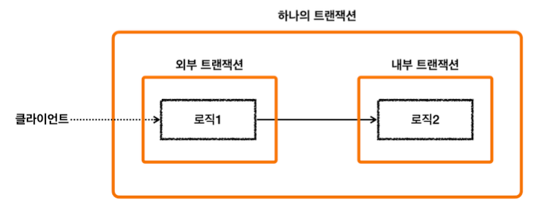
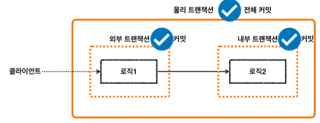
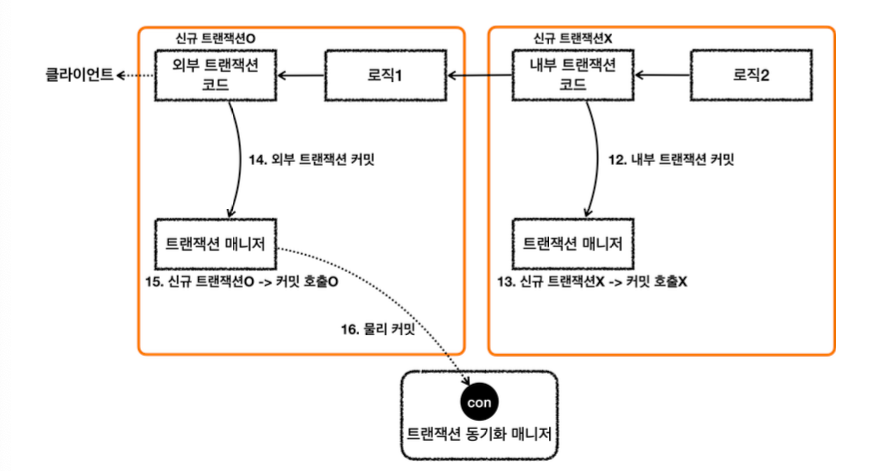
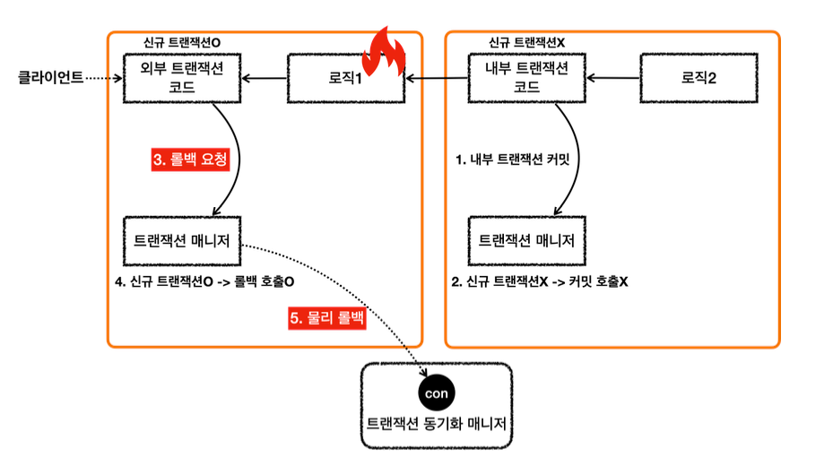
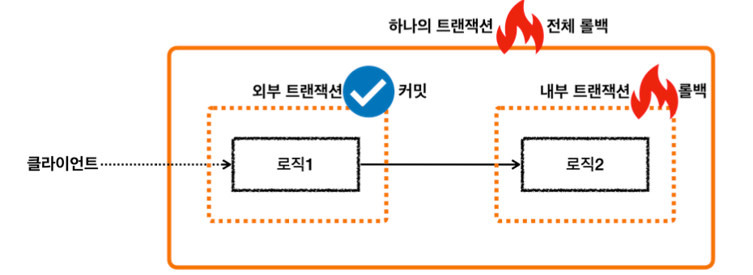
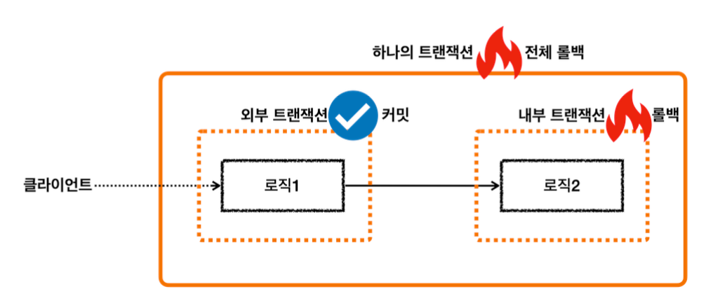
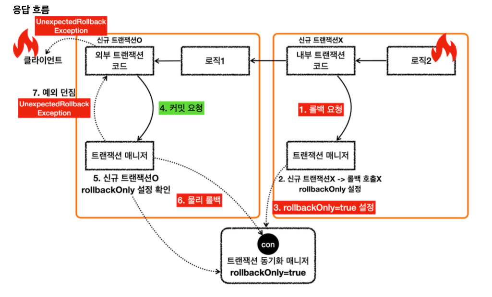
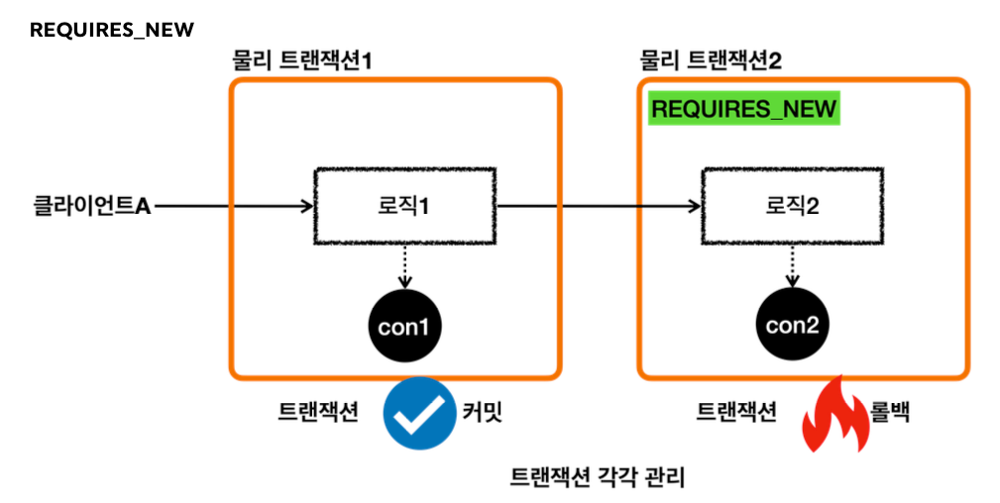
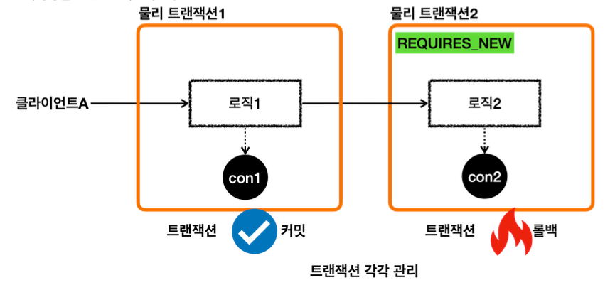
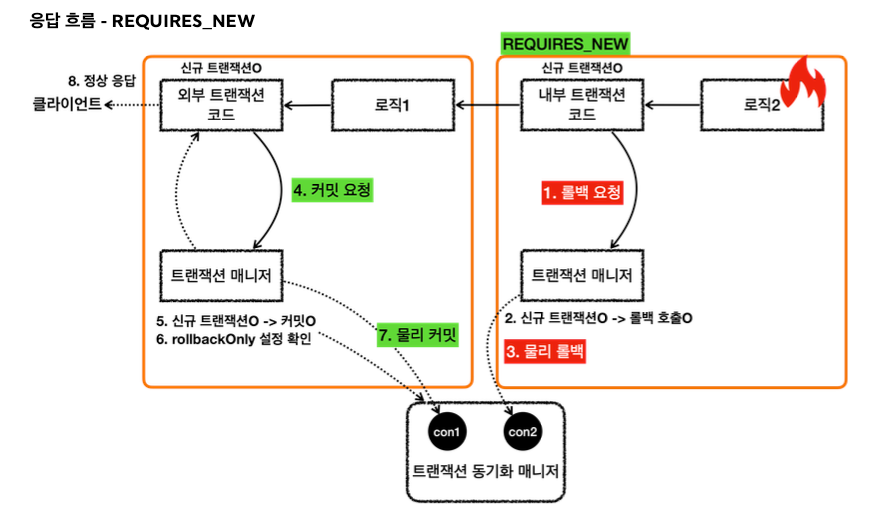

<!-- TOC -->
* [스프링 트랜잭션 전파 3 - 전파 기본](#스프링-트랜잭션-전파-3---전파-기본)
  * [트랜잭션 전파가 뭔데?](#트랜잭션-전파가-뭔데)
  * [트랜잭션 전파의 기본 옵션인 REQUIRED](#트랜잭션-전파의-기본-옵션인-required)
    * [외부 트랜잭션이 수행 중인데, 내부 트랜잭션이 추가로 수행되는 경우](#외부-트랜잭션이-수행-중인데-내부-트랜잭션이-추가로-수행되는-경우)
    * [스프링은 트랜잭션을 통합한다](#스프링은-트랜잭션을-통합한다)
  * [물리 트랜잭션과 논리 트랜잭션](#물리-트랜잭션과-논리-트랜잭션)
    * [물리 트랜잭션](#물리-트랜잭션)
    * [논리 트랜잭션](#논리-트랜잭션)
  * [논리 트랜잭션 대원칙 ⭐️⭐️⭐️](#논리-트랜잭션-대원칙-)
* [스프링 트랜잭션 전파4 - 전파 예제](#스프링-트랜잭션-전파4---전파-예제)
  * [외부, 내부 둘 다 커밋하는 경우](#외부-내부-둘-다-커밋하는-경우)
  * [외부 트랜잭션만 물리 트랜잭션을 시작하고 커밋한다](#외부-트랜잭션만-물리-트랜잭션을-시작하고-커밋한다)
  * [그림을 통해 실제 트랜잭션 동작 자세히 이해하기](#그림을-통해-실제-트랜잭션-동작-자세히-이해하기)
    * [요청 흐름 - 외부 트랜잭션](#요청-흐름---외부-트랜잭션)
    * [요청 흐름 - 내부 트랜잭션](#요청-흐름---내부-트랜잭션)
    * [응답 흐름 - 내부 트랜잭션](#응답-흐름---내부-트랜잭션)
    * [응답 흐름 - 외부 트랜잭션](#응답-흐름---외부-트랜잭션)
* [스프링 트랜잭션 전파5 - 외부 롤백](#스프링-트랜잭션-전파5---외부-롤백-)
  * [내부 트랜잭션은 커밋되는데 외부 트랜잭션은 롤백되는 경우](#내부-트랜잭션은-커밋되는데-외부-트랜잭션은-롤백되는-경우)
    * [테스트 코드](#테스트-코드)
    * [실행 결과](#실행-결과)
  * [응답 흐름](#응답-흐름)
    * [응답 흐름 - 내부 트랜잭션](#응답-흐름---내부-트랜잭션-1)
    * [응답 흐름 - 외부 트랜잭션](#응답-흐름---외부-트랜잭션-1)
* [스프링 트랜잭션 전파6 - 내부 롤백](#스프링-트랜잭션-전파6---내부-롤백)
  * [내부 트랜잭션은 롤백되는데 외부 트랜잭션은 커밋된다면?](#내부-트랜잭션은-롤백되는데-외부-트랜잭션은-커밋된다면)
    * [테스트 코드](#테스트-코드-1)
    * [실행 로그와 그에 대한 설명 ⭐️️️️️️️️️️️️️️️️️⭐️⭐️](#실행-로그와-그에-대한-설명-)
  * [내부 롤백 과정 파헤치기](#내부-롤백-과정-파헤치기)
    * [응답 흐름 - 내부 트랜잭션](#응답-흐름---내부-트랜잭션-2)
    * [응답 흐름 - 외부 트랜잭션 (UnexpectedRollbackException)](#응답-흐름---외부-트랜잭션-unexpectedrollbackexception-)
    * [전체 과정 시각화](#전체-과정-시각화)
    * [스프링 소스 확인](#스프링-소스-확인)
  * [내부 트랜잭션 롤백 정리](#내부-트랜잭션-롤백-정리-)
    * [👨🏻‍🏫 참고) 영한쌤의 킥! - 개발은 명확해야한다.](#-참고-영한쌤의-킥---개발은-명확해야한다-)
* [스프링 트랜잭션 전파7 - REQUIRES_NEW](#스프링-트랜잭션-전파7---requires_new-)
  * [REQUIRES_NEW](#requires_new)
    * [테스트 코드](#테스트-코드-)
    * [실행 결과와 설명](#실행-결과와-설명-)
  * [그림으로 이해하는 REQUIRES_NEW](#그림으로-이해하는-requires_new)
    * [요청 흐름 - 외부 트랜잭션](#요청-흐름---외부-트랜잭션-1)
    * [요청 흐름 - 내부 트랜잭션](#요청-흐름---내부-트랜잭션-1)
    * [응답 흐름 - 내부 트랜잭션](#응답-흐름---내부-트랜잭션-3)
    * [응답 흐름 - 외부 트랜잭션](#응답-흐름---외부-트랜잭션-2)
  * [정리](#정리)
  * [주의할 부분! 한 번의 HTTP 요청에 2개의 DB 커넥션이 사용된다. with 실무 사례!!](#주의할-부분-한-번의-http-요청에-2개의-db-커넥션이-사용된다-with-실무-사례)
    * [실무 사례](#실무-사례)
* [스프링 트랜잭션 전파8 - 다양한 전파 옵션](#스프링-트랜잭션-전파8---다양한-전파-옵션)
* [스프링 트랜잭션 전파 기본 정리](#스프링-트랜잭션-전파-기본-정리-)
<!-- TOC -->

<br>

# 스프링 트랜잭션 전파 3 - 전파 기본

## 트랜잭션 전파가 뭔데?

- 트랜잭션을 각각 사용하는 것이 아니라, 트랜잭션이 이미 진행중인데, 여기에 추가로 트랜잭션을 수행하면 트랜잭션이 어떻게 되어야하지?? 
- 기존 트랜잭션과 별개의 트랜잭션을 시작할까? 
  - 아니면, 기존 트랜잭션을 그대로 이어받아서 같은 트랜잭션으로 진행할까? 
- 이럴 경우 어떻게 트랜잭션이 동작할지 결정하는 것이 바로 `트랜잭션 전파(propagation)`라고한다.
  - 스프링에서는 다양한 트랜잭션 전파 옵션(기존 거에 참여할 지, 새로 시작할 지 등..)을 제공함.

---
<br>

## 트랜잭션 전파의 기본 옵션인 REQUIRED

### 외부 트랜잭션이 수행 중인데, 내부 트랜잭션이 추가로 수행되는 경우


- 외부 트랜잭션이 시작했는데, 아직  안 끝난 상태에서 내부 트랜잭션이 추가된다.
  - 이 경우 스프링은 어떻게 해줄까?

### 스프링은 트랜잭션을 통합한다



- 외부 트랜잭션이 끝나지 않았는데, 내부 트랜잭션이 추가되는 경우 스프링은 외부/내부 트랜잭션을 묶어서 하나의 트랜잭션을 만든다.
- 즉, **내부 트랜잭션이 외부 트랜잭션에 참여한다.** (REQUIRED 옵션 기준)

---
<br>

## 물리 트랜잭션과 논리 트랜잭션


- 스프링은 이해를 돕기 위해 물리 트랜잭션과 논리 트랜잭션 개념이 존재

### 물리 트랜잭션
  
- **= 실제 데이터베이스에 적용되는 트랜잭션.**
- 실제 커넥션을 통해서 트랜잭션을 시작(=`setAutoCommit(false)`)하고, 실제 커넥션을 통해서 커밋, 롤백하는 단위를 의미한다.

### 논리 트랜잭션

- **= 트랜잭션 매니저를 통해 트랜잭션을 사용하는 단위.**
- 논리 트랜잭션 개념은 외부 트랜잭션이 진행되는 도중 내부에 추가적으로 트랜잭션이 사용되는 경우에만 나타난다.
  - (트랜잭션이 하나인 경우, 물리 트랜잭션 == 논리 트랜잭션이므로 물리/논리 개념을 나눌 필요가 없음.)
- 더 정확히는 `REQUIRED` 전파 옵션을 사용하는 경우에 논리 트랜잭션 개념이 나타난다. (자세한 내용은 추후 설명)

---
<br>

## 논리 트랜잭션 대원칙 ⭐️⭐️⭐️

> - **모든 논리 트랜잭션이 커밋되어야 물리 트랜잭션이 커밋된다.** 
> - **하나의 논리 트랜잭션이라도 롤백되면 물리 트랜잭션은 롤백된다.**

- 즉, 트랜잭션 매니저의 모든 트랜잭션의 커밋되어야 물리 트랜잭션이 커밋된다.
- 하나의 트랜잭션 매니저라도 롤백하면 물리 트랜잭션은 롤백된다.

---
<br>

# 스프링 트랜잭션 전파4 - 전파 예제

## 외부, 내부 둘 다 커밋하는 경우



```java
/**
 * o.f.s.propagation.BasicTxTest            : 외부 트랜잭션 시작 👈
 * o.s.j.d.DataSourceTransactionManager     : Creating new transaction with name [null]: PROPAGATION_REQUIRED,ISOLATION_DEFAULT
 * o.s.j.d.DataSourceTransactionManager     : Acquired Connection [HikariProxyConnection@629230908 wrapping conn0: url=jdbc:h2:mem:6dc24db1-a471-4342-91d0-1fe3c1ff985e user=SA] for JDBC transaction
 * o.s.j.d.DataSourceTransactionManager     : Switching JDBC Connection [HikariProxyConnection@629230908 wrapping conn0: url=jdbc:h2:mem:6dc24db1-a471-4342-91d0-1fe3c1ff985e user=SA] to manual commit
 * o.f.s.propagation.BasicTxTest            : outer.isNewTransaction()=true
 * <p>
 * o.f.s.propagation.BasicTxTest            : 내부 트랜잭션 시작 👈
 * o.s.j.d.DataSourceTransactionManager     : Participating in existing transaction
 * o.f.s.propagation.BasicTxTest            : inner.isNewTransaction()=false
 * o.f.s.propagation.BasicTxTest            : 내부 트랜잭션 커밋
 * <p>
 * o.f.s.propagation.BasicTxTest            : 외부 트랜잭션 커밋 👈
 * o.s.j.d.DataSourceTransactionManager     : Initiating transaction commit
 * o.s.j.d.DataSourceTransactionManager     : Committing JDBC transaction on Connection [HikariProxyConnection@629230908 wrapping conn0: url=jdbc:h2:mem:6dc24db1-a471-4342-91d0-1fe3c1ff985e user=SA]
 * o.s.j.d.DataSourceTransactionManager     : Releasing JDBC Connection [HikariProxyConnection@629230908 wrapping conn0: url=jdbc:h2:mem:6dc24db1-a471-4342-91d0-1fe3c1ff985e user=SA] after transaction*/
@Test
void inner_commit() {
    log.info("외부 트랜잭션 시작");
    TransactionStatus outer = txManager.getTransaction(new DefaultTransactionAttribute());
    log.info("outer.isNewTransaction()={}", outer.isNewTransaction());
    
    log.info("내부 트랜잭션 시작");
    TransactionStatus inner = txManager.getTransaction(new DefaultTransactionAttribute()); // 외부 트랜잭션을 하고 있는데 또 트랜잭션을 시작. 이것이 바로 내부 트랜잭션.
    log.info("inner.isNewTransaction()={}", inner.isNewTransaction());
    log.info("내부 트랜잭션 커밋");
    txManager.commit(inner);
    
    log.info("외부 트랜잭션 커밋");
    txManager.commit(outer);
}
```

- 외부 트랜잭션은 처음 시작하는 트랜잭션이므로 `isNewTransaction() = true`
- 내부 트랜잭션 시작하는 시점에서, 이미 외부 트랜잭션이 진행 중이다.
  - 👉 **이 때 내부 트랜잭션이 외부 트랜잭션에 참여!**
- 트랜잭션에 참여한다의 뜻
  - 👉 **외부 트랜잭션과 내부 트랜잭션이 하나의 트랜잭션으로 묶이는 것!**
- 외부 & 내부 모두 트랜잭션에 커밋할 경우 해당 통합된 트랜잭션은 커밋된다.


## 외부 트랜잭션만 물리 트랜잭션을 시작하고 커밋한다

- 예제에서는 외부 트랜잭션과 내부 트랜잭션이 하나의 물리 트랜잭션으로 묶인다고 설명했다.
- 그런데 코드를 잘보면, 다음과 같이 내부-외부 순서로 각각 커밋했다.

```java
txManager.commit(inner);
txManager.commit(outer);
```

- 트랜잭션은 생각해보면 하나의 커넥션에 커밋은 한 번만 호출할 수 있는데, 어떻게 이렇게 **_하나의 커넥션에 커밋을 두 번이나 호출할 수 있는 걸까?_**

```text
 * o.f.s.propagation.BasicTxTest            : 외부 트랜잭션 시작 👈
 * o.s.j.d.DataSourceTransactionManager     : Creating new transaction with name [null]: PROPAGATION_REQUIRED,ISOLATION_DEFAULT
 * o.s.j.d.DataSourceTransactionManager     : Acquired Connection [HikariProxyConnection@629230908 wrapping conn0: url=jdbc:h2:mem:6dc24db1-a471-4342-91d0-1fe3c1ff985e user=SA] for JDBC transaction
 * o.s.j.d.DataSourceTransactionManager     : Switching JDBC Connection [HikariProxyConnection@629230908 wrapping conn0: url=jdbc:h2:mem:6dc24db1-a471-4342-91d0-1fe3c1ff985e user=SA] to manual commit
 * o.f.s.propagation.BasicTxTest            : outer.isNewTransaction()=true
 * <p>
 * o.f.s.propagation.BasicTxTest            : 내부 트랜잭션 시작 👈
 * o.s.j.d.DataSourceTransactionManager     : Participating in existing transaction
 * o.f.s.propagation.BasicTxTest            : inner.isNewTransaction()=false
 * o.f.s.propagation.BasicTxTest            : 내부 트랜잭션 커밋
 * <p>
 * o.f.s.propagation.BasicTxTest            : 외부 트랜잭션 커밋 👈
 * o.s.j.d.DataSourceTransactionManager     : Initiating transaction commit
 * o.s.j.d.DataSourceTransactionManager     : Committing JDBC transaction on Connection [HikariProxyConnection@629230908 wrapping conn0: url=jdbc:h2:mem:6dc24db1-a471-4342-91d0-1fe3c1ff985e user=SA]
 * o.s.j.d.DataSourceTransactionManager     : Releasing JDBC Connection [HikariProxyConnection@629230908 wrapping conn0: url=jdbc:h2:mem:6dc24db1-a471-4342-91d0-1fe3c1ff985e user=SA] after transaction*/
```

- 로그를 잘보자. 내부 트랜잭션이 시작할 때 발생한 `Participating in existing transaction`로그에 주목하자.
  - 이 메시지는 내부 트랜잭션이 기존 내부 트랜잭션에 참여한다는 뜻이다.
- 다른 로그도 살펴보자. 외부 트랜잭션을 시작하거나 커밋할 때는 DB 커넥션을 이용해서 물리 트랜잭션을 시작(=`setAutoCommit(false)`)하고 & DB 커넥션을 통해 커밋하는 것을 확인할 수 있다.
  - 👉 즉 외부 트랜잭션만 물리 트랜잭션을 시작하고, 커밋한다.
  -  `Switching JDBC Connection [HikariProxyConnection@629230908 wrapping conn0: url=jdbc:h2:mem:6dc24db1-a471-4342-91d0-1fe3c1ff985e user=SA] to manual commit`
- 생각해보라. 내부 트랜잭션이 실제 물리 트랜잭션을 커밋한다면 그 자체로 트랜잭션이 끝나기 때문에, 이렇게 되면 처음 시작된 외부 트랜잭션을 이어갈 수 없다. 
  - 그래서 내부 트랜잭션은 물리 트랜잭션을 커밋할 수 없고, 내부 트랜잭션이 커밋되어도 아무런 동작을 하지 않는다.
- 스프링에서는 이렇게 여러 트랜잭션이 사용되는 경우, **처음 트랜잭션을 시작한 외부 트랜잭션만 실제 물리 트랜잭션을 관리하도록 한다.** 
  - 스프링은 이를 통해 **트랜잭션 중복 커밋 문제를 해결**한다.

## 그림을 통해 실제 트랜잭션 동작 자세히 이해하기


### 요청 흐름 - 외부 트랜잭션

1. `txManager.getTransaction()` 를 호출해서 외부 트랜잭션을 시작한다.
2. 트랜잭션 매니저는 데이터소스를 통해 커넥션을 생성한다.
3. 생성한 커넥션을 수동 커밋 모드( `setAutoCommit(false)` )로 설정한다. - **물리 트랜잭션 시작**
4. 트랜잭션 매니저는 트랜잭션 동기화 매니저에 커넥션을 보관한다.
5. 트랜잭션 매니저는 트랜잭션을 생성한 결과를 `TransactionStatus` 에 담아서 반환하는데, 여기에 신규
   트랜잭션의 여부가 담겨 있다. `isNewTransaction` 를 통해 신규 트랜잭션 여부를 확인할 수 있다. 트랜
   잭션을 처음 시작했으므로 신규 트랜잭션이다.( `true` )
6. 로직1이 사용되고, 커넥션이 필요한 경우 트랜잭션 동기화 매니저를 통해 트랜잭션이 적용된 커넥션을 획득
      해서 사용한다.

### 요청 흐름 - 내부 트랜잭션

7. `txManager.getTransaction()` 를 호출해서 내부 트랜잭션을 시작한다.
8. 트랜잭션 매니저는 트랜잭션 동기화 매니저를 통해서 기존 트랜잭션이 존재하는지 확인한다.
9. 기존 트랜잭션이 존재하므로 기존 트랜잭션에 참여한다. 기존 트랜잭션에 참여한다는 뜻은 사실 아무것도
   하지 않는다는 뜻이다.
   이미 기존 트랜잭션인 외부 트랜잭션에서 물리 트랜잭션을 시작했다. 그리고 물리 트랜잭션이 시작된 커넥 션을 트랜잭션 동기화 매니저에 담아두었다. 따라서 이미 물리 트랜잭션이 진행중이므로 그냥 두면 이후 로직(여기서는 `로직2`)이 기존에 시작된 트랜잭션을 자연스럽게 사용하게 되는 것이다. 이후 로직은 자연스럽게 트랜잭션 동기화 매니저에 보관된 기존 커넥션을 사용하게 된다.
10. 트랜잭션 매니저는 트랜잭션을 생성한 결과를 `TransactionStatus` 에 담아서 반환하는데, 여기에서 `isNewTransaction` 를 통해 신규 트랜잭션 여부를 확인할 수 있다. 여기서는 기존 트랜잭션에 참여했기 때문에 신규 트랜잭션이 아니다. ( `false` )
11. 로직2가 사용되고, 커넥션이 필요한 경우 트랜잭션 동기화 매니저를 통해 외부 트랜잭션이 보관한 커넥션을
    획득해서 사용한다.



### 응답 흐름 - 내부 트랜잭션

12. 로직2가 끝나고 트랜잭션 매니저를 통해 내부 트랜잭션을 커밋.
13. 트랜잭션 매니저는 커밋 시점에 신규 트랜잭션 여부에 따라 다르게 처리.
    - 여기서는 신규 트랜잭션이 아니기 때문에(=내부 트랜잭션이므로), 실제 커밋을 호출하지 않는다.
    - DB 커넥션의 커밋을 호출해버리면 물리 트랜잭션이 끝나버리니까, 실제 커밋을 호출하지는 않는다. 

### 응답 흐름 - 외부 트랜잭션

14. 로직1이 끝나고, 트랜잭션 매니저를 통해 외부 트랜잭션을 커밋.
15. 트랜잭션 매니저는 커밋 시점에 따라 다르게 처리한다.
    - **여기서는 신규 트랜잭션이 맞기 때문에, DB 커넥션에 실제 커밋을 호출한다.** 
16. 트랜잭션 매니저 커밋하는 것이 논리적인 커밋이라면, 실제 커넥션에 커밋하는 것은 물리 커밋으로 볼 수 있다. 
    - **외부 트랜잭션이 커밋되면, 실제 데이터베이스에 커밋이 
        반영되고, 물리 트랜잭션도 끝이난다.**

---

# 스프링 트랜잭션 전파5 - 외부 롤백 

## 내부 트랜잭션은 커밋되는데 외부 트랜잭션은 롤백되는 경우

- 논리 트랜잭션이 둘 다 커밋되어야만 물리 트랜잭션이 커밋된다.
- 즉, **논리 트랜잭션이 하나라도 롤백되면 전체 물리 트랜잭션은 롤백된다.** 


### 테스트 코드

```java
@Test
void outer_rollback() {
    log.info("외부 트랜잭션 시작");
    TransactionStatus outer = txManager.getTransaction(new DefaultTransactionAttribute());
    log.info("outer.isNewTransaction()={}", outer.isNewTransaction());

    log.info("내부 트랜잭션 시작");
    TransactionStatus inner = txManager.getTransaction(new DefaultTransactionAttribute());
    log.info("inner.isNewTransaction()={}", inner.isNewTransaction());
    log.info("내부 트랜잭션 커밋");
    txManager.commit(inner);

    log.info("외부 트랜잭션 롤백");
    txManager.rollback(outer);
}
```

### 실행 결과

```java
/**
 * o.f.s.propagation.BasicTxTest            : 외부 트랜잭션 시작
 * o.s.j.d.DataSourceTransactionManager     : Creating new transaction with name [null]: PROPAGATION_REQUIRED,ISOLATION_DEFAULT
 * o.s.j.d.DataSourceTransactionManager     : Acquired Connection [HikariProxyConnection@1247158141 wrapping conn0: url=jdbc:h2:mem:42e400d3-e6ee-414d-b2f9-1e78f23d8002 user=SA] for JDBC transaction
 * o.s.j.d.DataSourceTransactionManager     : Switching JDBC Connection [HikariProxyConnection@1247158141 wrapping conn0: url=jdbc:h2:mem:42e400d3-e6ee-414d-b2f9-1e78f23d8002 user=SA] to manual commit 👈 물리 트랜잭션 시작 = setAutoCommit(false)
 * o.f.s.propagation.BasicTxTest            : outer.isNewTransaction()=true
 * 
 * o.f.s.propagation.BasicTxTest            : 내부 트랜잭션 시작
 * o.s.j.d.DataSourceTransactionManager     : Participating in existing transaction
 * o.f.s.propagation.BasicTxTest            : inner.isNewTransaction()=false
 * o.f.s.propagation.BasicTxTest            : 내부 트랜잭션 커밋
 * 
 * o.f.s.propagation.BasicTxTest            : 외부 트랜잭션 롤백
 * o.s.j.d.DataSourceTransactionManager     : Initiating transaction rollback
 * o.s.j.d.DataSourceTransactionManager     : Rolling back JDBC transaction on Connection [HikariProxyConnection@1247158141 wrapping conn0: url=jdbc:h2:mem:42e400d3-e6ee-414d-b2f9-1e78f23d8002 user=SA]
 * o.s.j.d.DataSourceTransactionManager     : Releasing JDBC Connection [HikariProxyConnection@1247158141 wrapping conn0: url=jdbc:h2:mem:42e400d3-e6ee-414d-b2f9-1e78f23d8002 user=SA] after transaction
 */
```

- 외부 트랜잭션이 물리 트랜잭션을 시작.
- 내부 트랜잭션이 외부 트랜잭션에 참여한다.
- 내부 트랜잭션 로직에서 INSERT/UPDATE가 일어난다면 트랜잭션 매니저를 통해서하게되는데, 
- 이 때 앞의 외부 트랜잭션이 이미 DB 커넥션을 맺어놓았기 때문에 그 외부 커넥션을 다시 가져와서 쓰게 된다.
  - JPA에서는 트랜잭션 커밋 -> 플러시 -> DB 트랜잭션 커밋 작업이 이루어짐.
- 내부 트랜잭션을 커밋하는데, 이 때 신규 트랜잭션이 아니므로 아무런 작업이 이루어지지 않는다.
- 외부 트랜잭션 롤백 시, 물리 트랜잭션이 롤백된다. ( `Rolling back JDBC transaction on Connection` )

## 응답 흐름

 


### 응답 흐름 - 내부 트랜잭션

1. `로직2`가 끝나고, 내부 트랜잭션을 커밋한다.
2. 트랜잭션 매니저는 커밋 시점에 신규 트랜잭션 여부에 따라 다르게 동작.
   - 이 경우 신규 트랜잭션이 아니므로 실제 커밋을 호출하지 않는다. 

### 응답 흐름 - 외부 트랜잭션

3. `로직1`이 끝나고, 외부 트랜잭션을 커밋한다.
4. 트랜잭션 매니저는 롤백 시점에 신규 트랜잭션 여부에 따라 다르게 동작한다.
   - 이 때 외부 트랜잭션은 신규 트랜잭션이므로, DB 커넥션에 실제 롤백을 호출한다.
5. 트랜잭션 매니저에 롤백을 하는 것이 논리 롤백이라면 실제 커넥션에 롤백하는 것은 물리 롤백이다.
   - 물리 롤백을 하였으므로, 실제 데이터베이스에 롤백이 반영되고, 물리 트랜잭션도 종료된다.

---

# 스프링 트랜잭션 전파6 - 내부 롤백

## 내부 트랜잭션은 롤백되는데 외부 트랜잭션은 커밋된다면?



- 내부 트랜잭션은 롤백했지만, 내부 트랜잭션은 물리 트랜잭션에 영향을 주지 않는다고 배웠다.
- 그런데 논리 트랜잭션 둘 중 하나라도 롤백되면 전체 물리 트랜잭션이 롤백된다고 배웠고, 
  - 또 이와 충돌되게 외부 트랜잭션이 커밋되면 물리 트랜잭션이 커밋된다고 배웠다.
- 자 그럼 스프링은 이 문제를 어떻게 해결할까? 천천히 알아보자.

### 테스트 코드

```java
@Test
void inner_rollback() {
    log.info("외부 트랜잭션 시작");
    TransactionStatus outer = txManager.getTransaction(new DefaultTransactionAttribute());
    log.info("outer.isNewTransaction()={}", outer.isNewTransaction());

    log.info("내부 트랜잭션 시작");
    TransactionStatus inner = txManager.getTransaction(new DefaultTransactionAttribute());
    log.info("inner.isNewTransaction()={}", inner.isNewTransaction());
    log.info("내부 트랜잭션 롤백");
    txManager.rollback(inner); // rollback-only로 어딘가에 표시.

    log.info("외부 트랜잭션 커밋");
    txManager.commit(outer); // 에러 발생해서 테스트는 실패한다.
}
```

### 실행 로그와 그에 대한 설명 ⭐️️️️️️️️️️️️️️️️️⭐️⭐️

```java
/**
 * o.f.s.propagation.BasicTxTest            : 외부 트랜잭션 시작
 * o.s.j.d.DataSourceTransactionManager     : Creating new transaction with name [null]: PROPAGATION_REQUIRED,ISOLATION_DEFAULT
 * o.s.j.d.DataSourceTransactionManager     : Acquired Connection [HikariProxyConnection@1247158141 wrapping conn0: url=jdbc:h2:mem:616152a3-8cda-4c86-aa3e-2c2bc523c913 user=SA] for JDBC transaction
 * o.s.j.d.DataSourceTransactionManager     : Switching JDBC Connection [HikariProxyConnection@1247158141 wrapping conn0: url=jdbc:h2:mem:616152a3-8cda-4c86-aa3e-2c2bc523c913 user=SA] to manual commit
 * o.f.s.propagation.BasicTxTest            : outer.isNewTransaction()=true
 *
 * o.f.s.propagation.BasicTxTest            : 내부 트랜잭션 시작
 * o.s.j.d.DataSourceTransactionManager     : Participating in existing transaction
 * o.f.s.propagation.BasicTxTest            : inner.isNewTransaction()=false
 * o.f.s.propagation.BasicTxTest            : 내부 트랜잭션 롤백
 * o.s.j.d.DataSourceTransactionManager     : Participating transaction failed - marking existing transaction as rollback-only 👈 내부 트랜잭션에서 참여 중인 트랜잭션에 rollback-only로 마킹한다.
 * o.s.j.d.DataSourceTransactionManager     : Setting JDBC transaction [HikariProxyConnection@1247158141 wrapping conn0: url=jdbc:h2:mem:616152a3-8cda-4c86-aa3e-2c2bc523c913 user=SA] rollback-only
 *
 * o.f.s.propagation.BasicTxTest            : 외부 트랜잭션 커밋
 * o.s.j.d.DataSourceTransactionManager     : Global transaction is marked as rollback-only but transactional code requested commit
 * o.s.j.d.DataSourceTransactionManager     : Initiating transaction rollback 👈
 * o.s.j.d.DataSourceTransactionManager     : Rolling back JDBC transaction on Connection [HikariProxyConnection@1247158141 wrapping conn0: url=jdbc:h2:mem:616152a3-8cda-4c86-aa3e-2c2bc523c913 user=SA]
 * o.s.j.d.DataSourceTransactionManager     : Releasing JDBC Connection [HikariProxyConnection@1247158141 wrapping conn0: url=jdbc:h2:mem:616152a3-8cda-4c86-aa3e-2c2bc523c913 user=SA] after transaction
 *
 * org.springframework.transaction.UnexpectedRollbackException: Transaction rolled back because it has been marked as rollback-only
 *
 * 	at org.springframework.transaction.support.AbstractPlatformTransactionManager.processRollback(AbstractPlatformTransactionManager.java:938)
 * 	at org.springframework.transaction.support.AbstractPlatformTransactionManager.commit(AbstractPlatformTransactionManager.java:754)
 * 	at org.festilog.springtransaction.propagation.BasicTxTest.inner_rollback(BasicTxTest.java:228)
 * 	at java.base/java.lang.reflect.Method.invoke(Method.java:568)
 * 	at java.base/java.util.ArrayList.forEach(ArrayList.java:1511)
 * 	at java.base/java.util.ArrayList.forEach(ArrayList.java:1511)
 */
```

- 외부 트랜잭션 시작
  - 먼저 외부 트랜잭션을 시작하고, 물리 트랜잭션을 시작한다.
- 내부 트랜잭션 시작
  - 기존 외부 트랜잭션에 참여한다. (`Participating in existing transaction`)
- **내부 트랜잭션 롤백**
  - `Participating transaction failed - marking existing transaction as rollback-only`
  - 내부 트랜잭션을 롤백하는데, 실제 물리 트랜잭션을 롤백하지는 않는다.
  - 대신에, **기존 트랜잭션을 롤백 전용으로 표시한다.** ⭐️
- **외부 트랜잭션 커밋**
  - 외부 트랜잭션을 커밋한다.
  - `Global transaction is marked as rollback-only but transactional code requested commit`
  - 커밋을 호출했지만, **전체 트랜잭션이 롤백 전용으로 표시되어있다.** (내부 트랜잭션에서 전체 트랜잭션을 롤백 전용으로 표시했다.)


## 내부 롤백 과정 파헤치기





### 응답 흐름 - 내부 트랜잭션

1. `로직2`에서 뭔가 예외가 터졌다. 그래서 트랜잭션 매니저를 통해 내부 트랜잭션을 롤백한다.
2. 트랜잭션 매니저는 롤백 시점에 신규 트랜잭션 여부에 따라 롤백을 다르게 처리한다.
   - 이 경우 내부 트랜잭션은 신규 트랜잭션이 아니므로, 실제 물리 트랜잭션 롤백을 하진 않는다.
3. 내부 트랜잭션은 물리 트랜잭션을 롤백하지 않는 대신, **트랜잭션 동기화 매니저에 `rollbackOnly=true`라는 표시를 해둔다.**

### 응답 흐름 - 외부 트랜잭션 (UnexpectedRollbackException) 

4. `로직1`이 끝나고 트랜잭션 매니저를 통해 외부 트랜잭션을 커밋한다.
5. 트랜잭션 매니저는 신규 트랜잭션 여부에 따라 커밋 요청을 다르게 처리하는데,
   - 이 때 외부 트랜잭션은 신규 트랜잭션이므로 DB 커넥션에 실제 커밋을 호출해야한다. 
   - 그런데 이때 **먼저 트랜잭션 동기화 매니저에 롤백 전용 표시(rollbackOnly=true)를 확인하는데,** 
     - **롤백 전용 표시가 있으면 물리 트랜잭션을 커밋하는 것이 아니라 롤백한다.**
6. 트랜잭션 매니저의 롤백 요청에 의해 물리 트랜잭션이 롤백되고, 트랜잭션이 종료 된다.
7. ⭐️ 트랜잭션 매니저에 커밋을 요청한 개발자 입장에서는, **분명 커밋을 기대했지만 롤백 전용 표시로 인해 실제로는 롤백이되어버렸다!!!**
   - 이것은 조용히 지나칠 수는 없는 문제!! 시스템 입장에서는, 개발자가 커밋을 호출했지만 실제로는 롤백이 되었다는 사실을 분명히 알려주어야한다.
     - 개발자에게 안 알려주면 어떻게 될까? 예를 들면, 고객은 주문이 성공했다고 생각했는데, 실제로는 롤백이 되어서 주문이 생성되지 않은 상태가 되버린다.
   - 스프링은 이 경우 **UnexpectedRollbackException** 런타임 예외를 던진다. 그래서 개발자가 커밋을 시도했지만 기대하지 않은 롤백이 발생했다는 
     것을 개발자에게 명확하게 알려준다.

### 전체 과정 시각화

```mermaid
sequenceDiagram
    participant C as Client
    participant OT as Outer Transaction
    participant IT as Inner Transaction
    participant TM as TransactionManager
    participant TSM as TransactionSynchronizationManager
    participant DB as Database

    C->>OT: Start outer transaction
    OT->>TM: getTransaction()
    TM->>DB: Begin transaction
    TM->>TSM: Set transaction active
    TSM-->>TM: OK
    TM-->>OT: Return new transaction status
    Note over OT: isNewTransaction() = true

    OT->>IT: Start inner transaction
    IT->>TM: getTransaction()
    TM->>TSM: Check current transaction
    TSM-->>TM: Return active transaction
    TM-->>IT: Participate in existing transaction
    Note over IT: isNewTransaction() = false

    IT->>TM: rollback()
    TM->>TSM: Mark as rollback-only
    TSM-->>TM: OK
    Note over TSM: Logical rollback-only flag set

    IT-->>OT: Inner transaction ends

    OT->>TM: commit()
    TM->>TSM: Check transaction status
    TSM-->>TM: Rollback-only flag is set
    Note over TM: Decision to rollback
    TM->>DB: Rollback transaction
    DB-->>TM: OK
    TM-->>OT: Throw UnexpectedRollbackException
    OT-->>C: Propagate exception

    Note over C,DB: Entire transaction is rolled back
```

### 스프링 소스 확인

```java
public abstract class AbstractPlatformTransactionManager implements PlatformTransactionManager, Serializable {

    // ...

    @Override
    public final void commit(TransactionStatus status) throws TransactionException {
        if (status.isCompleted()) {
            throw new IllegalTransactionStateException(
                    "Transaction is already completed - do not call commit or rollback more than once per transaction");
        }

        DefaultTransactionStatus defStatus = (DefaultTransactionStatus) status;
        if (defStatus.isLocalRollbackOnly()) {
            if (defStatus.isDebug()) {
                logger.debug("Transactional code has requested rollback");
            }
            processRollback(defStatus, false);
            return;
        }
        
        if (!shouldCommitOnGlobalRollbackOnly() && defStatus.isGlobalRollbackOnly()) {
            if (defStatus.isDebug()) {
                logger.debug("Global transaction is marked as rollback-only but transactional code requested commit");
            }
            processRollback(defStatus, true);
            return;
        }

        processCommit(defStatus);
    }

    // ...
}
```

## 내부 트랜잭션 롤백 정리 

- 논리 트랜잭션이 하나라도 롤백되면 트랜잭션은 롤백된다.
- **내부 논리 트랜잭션이 롤백되면, 롤백 전용 마크를 표시한다.**
- **외부 트랜잭션을 커밋할 때 롤백 전용 마크를 확인한다.** 
  - 👉 **롤백 전용 마크가 표시되어 있으면, 물리 트랜잭션을 롤백하고 UnexpectedRollbackException 런타임 예외를 던진다.**

### 👨🏻‍🏫 참고) 영한쌤의 킥! - 개발은 명확해야한다. 

> - 애플리케이션 개발에서 중요한 기본 원칙은 모호함을 제거하는 것이다.
> - 개발은 명확해야한다. 이렇게 커밋을 호출했는데 내부에서 롤백이 발생한 경우 분명히 처리하지 않고 모호하게 둬버리면 매우 심각한 문제가 발생한다!
> - **이렇게 기대한 결과가 다른 경우, 예외를 발생시켜서 명확하게 문제를 알려주는 것이 좋은 설계이다.**

---

# 스프링 트랜잭션 전파7 - REQUIRES_NEW 

- 외부 트랜잭션과 내부 트랜잭션을 완전히 분리하는 방법은 없을까?
- 외부/내부 트랜잭션이 각각 별도의 물리 트랜잭션을 사용할 수 있다. 
- 그래서 커밋과 롤백도 각각 별도로 이루어진다.
- 커밋과 롤백이 각각. 별도로 이루어지므로, 서로의 커밋/롤백 여부가 서로의 트랜잭션에 영향을 주지 않는다.

## REQUIRES_NEW



- 위처럼 물리 트랜잭션을 분리하려면, **내부 트랜잭션을 시작할 때 `REQUIRES_NEW` 옵션을 사용하면 된다.**
- `REQUIRES_NEW`를 사용하게 되면, 외부/내부 트랜잭션이 각각 서로 다른 물리 트랜잭션을 갖게되어, **DB 커넥션 역시 따로 사용하게 된다.**
- 커넥션을 따로 사용하게 되어 서로의 물리 트랜잭션에 영향을 주지 않게 되면서, 
  - 최종적으로 롤백이 일어났던 `로직2`는 롤백이 되고, 커밋이 일어났던 `로직 1`은 커밋된다.

### 테스트 코드 

```java
@Test
void inner_rollback_requires_new() {
    // 외부 시작
    log.info("외부 트랜잭션 시작");
    TransactionStatus outer = txManager.getTransaction(new DefaultTransactionAttribute());
    log.info("outer.isNewTransaction()={}", outer.isNewTransaction());

    // 내부 시작
    log.info("내부 트랜잭션 시작");
    final DefaultTransactionAttribute definition = new DefaultTransactionAttribute();
    definition.setPropagationBehavior(TransactionDefinition.PROPAGATION_REQUIRES_NEW); // REQUIRES_NEW
    TransactionStatus inner = txManager.getTransaction(definition);
    log.info("inner.isNewTransaction()={}", inner.isNewTransaction());

    // 내부 롤백
    log.info("내부 트랜잭션 롤백");
    txManager.rollback(inner); // rollback-only로 어딘가에 표시.

    // 외부 커밋
    log.info("외부 트랜잭션 커밋");
    txManager.commit(outer);
}
```

- 내부 트랜잭션 시작 시 트랜잭션 전파 옵션을 `REQUIRES_NEW`로 설정  
  - `definition.setPropagationBehavior(TransactionDefinition.PROPAGATION_REQUIRES_NEW)`
  - 이 전파 옵션을 사용하면 내부 트랜잭션 시작 시 기존 트랜잭션에 참여하는 것이 아니라 새로운 물리 트랜잭션을 만들어 시작한다.

### 실행 결과와 설명 

```java
/**
 * o.f.s.propagation.BasicTxTest            : 외부 트랜잭션 시작
 * o.s.j.d.DataSourceTransactionManager     : Creating new transaction with name [null]: PROPAGATION_REQUIRED,ISOLATION_DEFAULT
 * o.s.j.d.DataSourceTransactionManager     : Acquired Connection [HikariProxyConnection@1676763984 wrapping conn0: url=jdbc:h2:mem:0d0f2d3f-66f0-43ec-954a-82e327823244 user=SA] for JDBC transaction
 * o.s.j.d.DataSourceTransactionManager     : Switching JDBC Connection [HikariProxyConnection@1676763984 wrapping conn0: url=jdbc:h2:mem:0d0f2d3f-66f0-43ec-954a-82e327823244 user=SA] to manual commit
 * o.f.s.propagation.BasicTxTest            : outer.isNewTransaction()=true
 * <p>
 * o.f.s.propagation.BasicTxTest            : 내부 트랜잭션 시작
 * o.s.j.d.DataSourceTransactionManager     : Suspending current transaction, creating new transaction with name [null]
 * o.s.j.d.DataSourceTransactionManager     : Acquired Connection [HikariProxyConnection@1594513480 wrapping conn1: url=jdbc:h2:mem:0d0f2d3f-66f0-43ec-954a-82e327823244 user=SA] for JDBC transaction
 * o.s.j.d.DataSourceTransactionManager     : Switching JDBC Connection [HikariProxyConnection@1594513480 wrapping conn1: url=jdbc:h2:mem:0d0f2d3f-66f0-43ec-954a-82e327823244 user=SA] to manual commit
 * o.f.s.propagation.BasicTxTest            : inner.isNewTransaction()=true
 * <p>
 * o.f.s.propagation.BasicTxTest            : 내부 트랜잭션 롤백
 * o.s.j.d.DataSourceTransactionManager     : Initiating transaction rollback
 * o.s.j.d.DataSourceTransactionManager     : Rolling back JDBC transaction on Connection [HikariProxyConnection@1594513480 wrapping conn1: url=jdbc:h2:mem:0d0f2d3f-66f0-43ec-954a-82e327823244 user=SA]
 * o.s.j.d.DataSourceTransactionManager     : Releasing JDBC Connection [HikariProxyConnection@1594513480 wrapping conn1: url=jdbc:h2:mem:0d0f2d3f-66f0-43ec-954a-82e327823244 user=SA] after transaction
 * o.s.j.d.DataSourceTransactionManager     : Resuming suspended transaction after completion of inner transaction
 * <p>
 * o.f.s.propagation.BasicTxTest            : 외부 트랜잭션 커밋
 * o.s.j.d.DataSourceTransactionManager     : Initiating transaction commit
 * o.s.j.d.DataSourceTransactionManager     : Committing JDBC transaction on Connection [HikariProxyConnection@1676763984 wrapping conn0: url=jdbc:h2:mem:0d0f2d3f-66f0-43ec-954a-82e327823244 user=SA]
 * o.s.j.d.DataSourceTransactionManager     : Releasing JDBC Connection [HikariProxyConnection@1676763984 wrapping conn0: url=jdbc:h2:mem:0d0f2d3f-66f0-43ec-954a-82e327823244 user=SA] after transaction
 */
```

- **외부 트랜잭션 시작**
  - 외부 트랜잭션을 시작하면서 물리 커넥션 `conn0`을 획득하고, 물리 트랜잭션을 시작한다.
    - (`switching connection jdbc connection to manual commit`)
  - 이 때 외부 트랜잭션은 신규 트랜잭션이다.
- **내부 트랜잭션 시작**
  - 내부 트랜잭션을 시작하면서, 기존 트랜잭션을 중지하고, 물리 트랜잭션을 새로 시작한다.
    - `Suspending current transaction, creating new transaction with name [null]`
    - 내부 트랜잭션이 새로 획득한 물리 트랜잭션은 `conn0` 이 아니라 `conn1`이다. **즉 다른 DB 커넥션을 사용한다.**
  - 내부 트랜잭션은 외부 트랜잭션에 참여하는게 아니라 **REQUIRES_NEW 옵션을 사용했으므로 완전히 새로운 신규 트랜잭션으로 생성됨.**
    - `inner.isNewTransaction()=true`
- **내부 트랜잭션 롤백**
  - 내부 트랜잭션을 롤백한다. 
  - 이 때 내부 트랜잭션은 **신규로 생성한 트랜잭션이기 때문에**, **실제 물리 트랜잭션(`conn1`)을 롤백한다.**
    - 내부 트랜잭션은 `conn1`을 사용하므로, `conn1`에 물리 롤백을 사용한다.  
  - 즉, **내부 트랜잭션 생성시 신규 물리 트랜잭션이 생성된다면 내부 커넥션(=내부 트랜잭션에서 맺은 물리 커넥션)만 사용한다.**
- **외부 트랜잭션 커밋**
  - 외부 트랜잭션을 커밋한다.
  - 외부 트랜잭션은 신규 트랜잭션이므로 실제 물리 트랜잭션을 커밋한다.
    - 이 때 외부 트랜잭션은 커넥션 `conn0`을 사용하므로, `conn0`에 물리 커밋을 수행한다.  

## 그림으로 이해하는 REQUIRES_NEW




### 요청 흐름 - 외부 트랜잭션

1. `txManager.getTransaction()`를 호출해서 외부 트랜잭션 시작. 
2. 트랜잭션 매니저가 데이터소스를 이용해서 커넥션을 생성한다.
3. 생성한 커넥션을 매뉴얼 커밋 모드로 변경한다. - **물리 트랜잭션 시작.** 
4. 커넥션을 트랜잭션 동기화 매니저에 보관한다.
5. 트랜잭션 매니저가 트랜잭션 생성 결과를 `TransactionStatus`에 담아서 리턴한다.
   - 여기에 신규 트랜잭션 여부가 담겨 있고, 트랜잭션을 처음 시작했으므로 신규 트랜잭션 여부는 참이다.
6. `로직1`이 사용되고, 이 때 커넥션이 필요하다면 트랜잭션 동기화 매니저를 통해 트랜잭션이 적용된 커넥션을 획득해서 커넥션을 사용한다. 

### 요청 흐름 - 내부 트랜잭션

7. `REQUIRES_NEW` 옵션과 함께 `txManager.getTransaction()`를 호출해서 내부 트랜잭션을 시작한다.
   - 이때 트랜잭션 매니저는 `REQUIRES_NEW` 옵션을 확인하고, **기존 트랜잭션에 참여하는 것이 아닌 신규 트랜잭션을 생성한다.**
8. 트랜잭션 매니저는 데이터 소스를 이용해서 커넥션을 생성한다. - _커넥션 생성_
9. 생성한 커넥션 `con2`의 커밋 모드를 매뉴얼로 변경한다. - _트랜잭션 시작_
10. 트랜잭션을 시작한 커넥션을 트랜잭션 동기화 매니저에 보관한다. - _트랜잭션 적용된 커넥션을 보관_
    - 이때 커넥션 `con1`이 잠시 보류되고, **지금부터는 `con2`가 사용된다.**  
    - `con1`이 삭제되는 것이 아니다. 여전히 트랜잭션 동기화 매니저 안에 살아있다. 그저 잠시 사용을 하지 않을 뿐이다.
    - `con2`가 나중에 돌아와서, 트랜잭션을 롤백해서 **내부 트랜잭션이 완료될때까지 `con2`만 사용**한다.  
11. 트랜잭션 매니저는 신규 트랜잭션을 생성한 결과를 반환한다.
12. `로직2`가 사용되고, 커넥션이 필요한 경우 트랜잭션 동기화 매니저에서 있는 트랜잭션이 적용된 커넥션 `con2`를 획득해서 사용한다.

---



### 응답 흐름 - 내부 트랜잭션

1. 내부 트랜잭션 로직인 `로직2`에서 런타임 예외가 발생하여 트랜잭션 롤백 요청을 하게 된다.
2. 트랜잭션 매니저에서 롤백 요청을 받는데, 현재 내부 트랜잭션은 신규 트랜잭션이므로, 실제 롤백을 호출한다.
3. 내부 트랜잭션이 `con2` 물리 트랜잭션을 롤백한다.
    - 트랜잭션이 종료되고, `con2`는 종료되거나 커넥션 풀에 반납된다.
    - 이후 보류되어있던 `con1`의 보류가 끝나고, 다시 커넥션 `con1`을 사용하게 된다.

### 응답 흐름 - 외부 트랜잭션

4. 외부 트랜잭션에 커밋을 요청한다.
5. 외부 트랜잭션은 신규 트랜잭션이므로 실제 커밋을 호출한다.
6. 이 때 트랜잭션 동기화 매니저에서 rollbackOnly 설정을 확인하는데 rollbackOnly=false이므로 그대로 물리 트랜잭션을 커밋한다. 
7. 외부 트랜잭션 본인이 만든 `con1` 커넥션을 통해 물리 트랜잭션을 커밋한다.
   - 트랜잭션이 종료되고, `con1`은 종료되거나 커넥션 풀에 반납된다.

## 정리

- REQUIRES_NEW 옵션을 사용하면 물리 트랜잭션이 명확하게 분리된다.
- REQUIRES_NEW를 사용하면 데이터베이스 커넥션이 동시에 2개 사용된다는 점을 주의한다.
  - **동시에 커넥션 2개를 물고 있게 된다.**

## 주의할 부분! 한 번의 HTTP 요청에 2개의 DB 커넥션이 사용된다. with 실무 사례!!

- `REQUIRES_NEW`를 사용하게 되면 **DB 커넥션을 2개 이상 쓰게 되므로, 커넥션이 빨리 고갈될 수 있다.**

### 실무 사례

- 내부 트랜잭션이 REQUIRES_NEW를 사용해서 트랜잭션을 새로 시작하게 되는 로직을 짰다고 하자.
- 내부 트랜잭션에서 엄청 오래걸리는 로직이 있다고 하자. 
- 그럼 분명히 고객이 500명 밖에 요청 안했는데, 커넥션은 1000개 사용하고 있고 그렇게 될 수 있다.
  - 이 때 `REQUIRES_NEW`를 의심해볼 수 있다. 

---

# 스프링 트랜잭션 전파8 - 다양한 전파 옵션


---

# 스프링 트랜잭션 전파 기본 정리 
