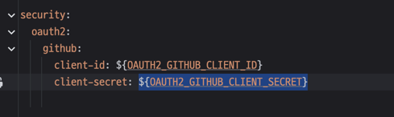

## yml에서 환경변수 주입 시  

### 안 되었던 케이스 (중괄호만 사용)

```yml
security:
  oauth2:
    github:
      client-id: {OAUTH2_GITHUB_CLIENT_ID}
      client-secret: {OAUTH2_GITHUB_CLIENT_SECRET}
```

### 되는 케이스 ✅

```yml
security:
  oauth2:
    github:
      client-id: ${OAUTH2_GITHUB_CLIENT_ID}
      client-secret: ${OAUTH2_GITHUB_CLIENT_SECRET}
```


- 인식할 수 있게되면 IntelliJ에서 밑줄을 쳐준다.
